# **Django** \- Framework web full stack open source baseado em python.

*Framework*, assim como uma biblioteca, é como uma caixa de ferramentas: um conjunto de recursos e facilidades que auxiliam um desenvolvedor na hora de construir um projeto.

*Full stack* pois auxilia tanto na parte do backend (servidor, banco de dados) como na parte frontend (cliente, parte visual).

*Open source* é um software cujo código-fonte é publicado e disponibilizado ao público, permitindo que qualquer pessoa copie, modifique e redistribua o código-fonte sem pagar royalties ou taxas.

O Django usa o modelo *MVT*, sendo:

**Model**: Estrutura que representa os dados da aplicação, possuindo ligação direta com um banco de dados. Essa camada serve para manipular, incluir ou excluir dados. Sempre que um model é criado, o django fornece uma API para esta manipulação.

**View**: É uma função python feita para receber uma requisição e enviar uma resposta em retorno. É aqui onde os dados são extraídos e produzem uma resposta.

**Template**: Essa é a parte que diz respeito a tudo que o usuário final é capaz de visualizar em seu dispositivo.

O usuário interage com o *View*. O view faz uma requisição ao *Model* para que este acesse o banco de dados e retorne os dados necessários para o *View*, que repassa para o *Template*, onde será gerado a página web que será enviada de volta ao usuário.

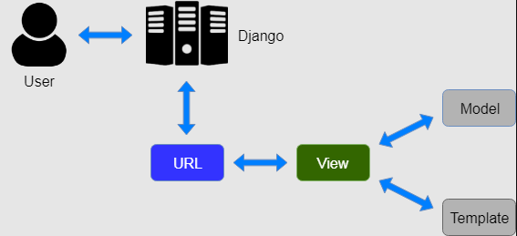

Uma das principais vantagens do Django é o reaproveitamento do código, o qual traz por si só diversos benefícios, mantendo o projeto mais simples ao passo que evita o retrabalho. Outra vantagem é a página admin que permite interagir diretamente com o banco de dados.

## Instalação Inicial:

Primeiro instale o Python, baixando-o do próprio site. Deve-se marcar a opção de adicioná-lo ao *PATH* durante a instalação para que ele possa ser acessado de qualquer pasta do computador.

**Extra:** Como passo adicional, é possível instalar virtualenv e virtualenvwrapper com os comandos:  

`pip install virtualenv`  
`pip install virtualenvwrapper-win`  

Após a instalação, é possível utilizar o seguinte comando para criar um ambiente virtual:  
`mkvirtualenv NOME\_DO\_AMBIENTE`  

Para trabalhar dentro desse ambiente, basta digitar:  
`workon NOME\_DO\_AMBIENTE`  

E para sair:  
`deactivate`  

A vantagem de se utilizar um ambiente virtual para se criar um projeto é saber o que é necessário para o funcionamento do projeto como um todo. Para isso, basta usar o seguinte comando dentro do ambiente virtual para saber tudo o que há instalado nele (a princípio, deve estar vazio):  
`pip freeze`  

Caso crie o ambiente virtual, digite os comandos seguintes dentro do ambiente (após usar workon) para instalar o django apenas no ambiente virtual. Caso contrário, o django será instalado na máquina e poderá ser acessado de qualquer pasta, assim como o python.

A seguir, abre o terminal do windows e instale os seguintes pacotes:  
`pip install django`  
`pip install django-crispy-forms`  
`pip install crispy-bootstrap4`  
`pip install django-braces`  
`pip install django-cleanup`  

Instale o VSCode, também baixando-o do próprio site. Algumas extensões úteis que podem ser baixadas no próprio VSCode:  
`Portuguese`  
`Python`  
`Bootstrap`  
`jQuery code snippets`

**Importante**: Utilize o terminal padrão do windows (cmd) ao invés do PowerShell, pois o PS pode dar conflito com o python, django e virtualenv.

**Criando e configurando o primeiro projeto:**  
No VSCode, abra o terminal (cmd) e digite:  
`django-admin startproject NOME\_DO\_PROJETO`  

**Extra:** Caso queira escolher outra pasta para criar o projeto, você pode mover pelas pastas do sistema usando os seguintes códigos no terminal:  
	`dir`		para listar todos os arquivos na pasta atual  
	`cd NOME`	para ir para a pasta escolhida  
	`cd ..` 		para voltar uma pasta

Após criar o projeto, vá em `Arquivo \- Abrir Pasta` e procure pela pasta criada pelo terminal.  

**Importante:** O comando `startproject` cria duas pastas com o mesmo nome. Ex:  
```
AppWeb  
    AppWeb  
    manage.py  
```
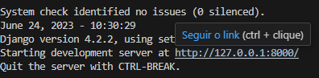  

Escolha a primeira pasta. Ao abrir a pasta, deve ter um arquivo `manage.py` no final. Caso não tenha, você deve ter aberto a segunda página.

Procure pelo arquivo `settings.py` e, próximo ao fim do arquivo, edite as seguintes linhas para definir o idioma para português e o fuso horário para SP:  
`LANGUAGE\_CODE \= 'pt-br'`  
`TIME\_ZONE \= 'America/Sao\_Paulo'`

Em seguida, digite no terminal os seguintes comandos:  
`python manage.py migrate`  
`python manage.py runserver`  

O primeiro serve para criar um banco de dados básico, que cobriremos mais tarde. O segundo serve para rodar na máquina um servidor e pôr o nosso site localmente no ar. Caso queira testar, basta clicar no link que aparece no terminal.  

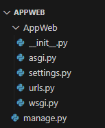  

Se tudo tiver dado certo, você deve ver a seguinte página:  

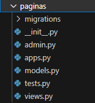  

Para encerrar a execução do servidor, aperte CTRL+C no terminal.

Para continuar, vamos criar um "super usuário" (ou Administrador). No terminal, digite:  
	*python manage.py createsuperuser*  
Pelo próprio terminal, preencha login, e-mail e senha. Você pode testar o login em:  
	*http://127.0.0.1:8000/admin*  
Por esse painel admin é possível interagir diretamente com o banco de dados. A princípio, temos apenas 'Grupos' e 'Usuários', criado pelo próprio Django quando o comando *'migrate'* foi utilizado. Veremos isso mais a frente, quando criarmos mais classes para o BD.

O próximo passo é criar o nosso primeiro módulo. Os módulos vão nos auxiliar a separar as funcionalidades da aplicação e manter tudo mais organizado. Começaremos criando um módulo para as páginas HTML que criaremos para o site. No terminal, digite:  
	*python manage.py startapp NOME\_DO\_MODULO*  
**Importante:** Para este projeto, chamarei este primeiro módulo de ***paginas***  
*python manage.py startapp **paginas***

O Django irá criar uma nova pasta no projeto com alguns arquivos.  
	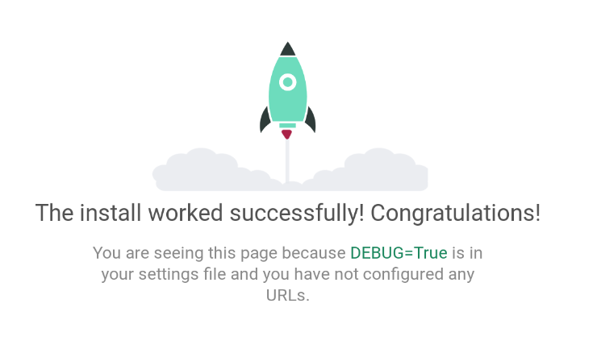  
*admin.py* 	Classes e modelos que vão aparecer na página admin  
	*apps.py*	Usado para ativar o módulo no projeto  
	*models.py*	Aqui vai ficar as classes do banco de dados  
	*tests.py*	Usado para criar testes automatizados  
	*views.py*	É aqui que vamos conectar as requisições e respostas e onde vai acontecer boa parte do código.

Vamos criar a primeira página da aplicação que será a página inicial do projeto. Vamos criar dentro da pasta do módulo (pasta páginas) uma pasta chamada *templates*, que terá todos os HTML que criarmos para as diferentes páginas do projeto. E, dentro da pasta, um arquivo chamado *index.html*, que será a nossa página inicial.  
	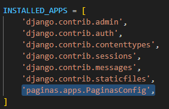

Apenas como teste, vamos pôr no *index.html* algo bem simples:  
\<\!DOCTYPE html\>  
\<html lang="pt-br"\>  
\<head\>  
\<meta charset="UTF-8"\>  
\<meta name="viewport" content="width=device-width, initial-scale=1.0"\>  
\<title\>Página Inicial\</title\>  
\</head\>  
\<body\>  
\<h3\>Bem vindos ao módulo páginas.\</h3\>  
\</body\>  
\</html\>

Com a página criada, vamos em *views.py*, trocando o seu conteúdo por:  
	*from django.views.generic import TemplateView*

*\# Create your views here.*  
*class IndexView(TemplateView):*  
    *template\_name \= "index.html"*  
Estamos importando o *TemplateView* do Django e usando-o como parâmetro para criar nossa classe *IndexView*. O único parâmetro que precisamos definir ao utilizar o *TemplateView* é *template\_name* e todo o resto será lidado pelo próprio django. Atente-se que o valor do atributo (*"index.html"*) é o mesmo nome que demos ao arquivo que criamos agora a pouco. Resta apenas importar esse template no projeto. Para isso, vamos em *settings.py* e, antes da primeira linha de código, vamos adicionar:  
	*import os*  
No mesmo arquivo, mais abaixo, vamos procurar por *TEMPLATES* e editar a linha *DIRS* para:  
	*'DIRS': \[os.path.join(BASE\_DIR, 'templates')\],*  
O que estamos fazendo aqui é adicionando aos templates do projeto a pasta *templates* que criamos anteriormente. Dessa forma, todos os arquivos que colocarmos naquela pasta já serão identificados pelo projeto automaticamente.

Além da página, precisamos configurar seu endereço. Para isso, dentro da pasta do módulo, vamos criar mais um arquivo chamado *urls.py* e nele vamos adicionar:  
	*from django.urls import path*  
*from .views import IndexView*

*urlpatterns \= \[*  
*path('inicio/', IndexView.as\_view(), name='inicio'),*  
*\]*  
Basicamente estamos informando que o endereço (*path*) *'início/'* vai ser "representado" pelo *IndexView* (que é a nossa página *index.html*). Agora, vamos no outro arquivo do projeto chamado *urls.py*, fora da pasta do módulo, e vamos editar para:  
	*from django.contrib import admin*  
*from django.urls import path, include*

*urlpatterns \= \[*  
    *path('admin/', admin.site.urls),*  
    *path('cadastros/', include('paginas.urls')),*  
*\]*  
Aqui nós estamos dando um nome para este caminho do link (*cadastros/*) e incluindo após ele o que estiver no arquivo em *paginas*/*urls.py*. Sendo assim, agora o endereço da nossa página inicial seria:  
	*http://127.0.0.1:8000/cadastros/inicio/*  
Caso queira, você pode deixar o *path* vazio para que não seja necessário adicionar nada no caminho da página e, portanto, encurtando o link. Dessa forma, podemos deletar *cadastros/* e deixar apenas:  
*path('', include('paginas.urls')),*  
Para ter como link inicial:  
	*http://127.0.0.1:8000/inicio/*

Mais uma vez, vamos acessar nosso arquivo *settings.py* e nele vamos procurar por *INSTALLED\_APPS*, adicionando dentro das \[ \], na última linha:  
	*'paginas.apps.PaginasConfig',*  
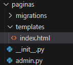  
Agora, com tudo configurado, devemos conseguir rodar o servidor e abrir nossa página em:  
	*http://127.0.0.1:8000/inicio/*  
**Arquivos Estáticos:**  
Arquivos estáticos são arquivos que são enviados ao navegador exatamente como estão no HD do servidor, ou seja, sempre serão os mesmos, não sofrendo alterações. Exemplo disso seriam arquivos de imagem, CSS e JavaScripts. Por questão de organização, vamos criar na 'raiz' do projeto (pasta base) uma pasta chamada static (padrão do Django) e mais uma pasta para cada tipo de arquivo, seguindo o seguinte modelo:  
	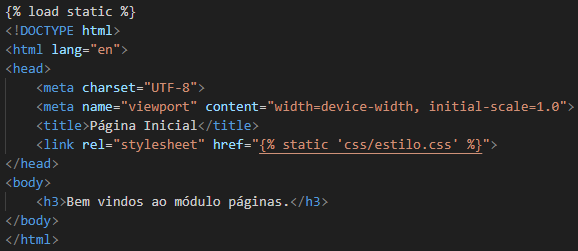  
Agora precisamos indicar ao nosso projeto onde essa pasta está localizada. Para isso, vamos abrir o arquivo *settings.py* e buscar por *STATIC\_URL*, adicionando logo após:  
	*STATIC\_URL \= 'static/'*

*STATICFILES\_DIRS \= \[*  
*os.path.join(BASE\_DIR, 'static')*  
*\]*

Para testar, vamos criar na pasta *css* que criamos a pouco um arquivo e chamá-lo de *estilo.css*. Nele vamos colocar:  
	*body{*  
*background-color: blue;*  
*}*  
Em *index.html* vamos adicionar duas linhas de código, a primeira na primeira linha do arquivo:  
	**  
E a segunda abaixo de *\<title\>*:  
	*\<link rel="stylesheet" href=""\>*  
Tendo algo como:  
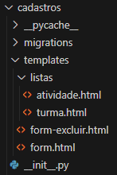  
Se atualizarmos nossa página inicial, devemos vê-la com uma cor de fundo diferente do branco padrão.

**Importante:** Usaremos essa notação do django com frequência e ela sempre segue esse mesmo padrão. Atente-se ao fato de que existe um espaço entre o comando e os símbolos %, assim como **não** há espaço entre as chaves {} e os símbolos %.  
	**

Podemos baixar uma imagem, colocá-la na pasta *img* e importá-la de forma similar, colocando na parte *body*, embaixo da *tag* *h3*:  
	*\*

**Extra:** Tente usar nomes simples e que indiquem o que o arquivo significa. É melhor *'logo.png'* do que *'1315885218621.png'*.  
**Criando um Modelo:**  
Agora vamos criar nosso primeiro modelo, já aproveitando para importar o BootStrap. O modelo será usado como base para as demais páginas HTML, servindo, por exemplo, para programar um menu de navegação que aparecerá em todas as páginas. Após criar esse menu uma única vez no arquivo modelo, podemos importá-lo facilmente nas outras páginas, reutilizando o código e mantendo o nosso projeto mais simples e mais facilmente editável. O BootStrap, por sua vez, irá nos ajudar principalmente com a interface da nossa aplicação web.

Primeiro, vamos acessar o site do BootStrap para pegar os links necessários. Em:  
*https://getbootstrap.com/docs/4.0/getting-started/introduction/*  
Nós teremos acesso a tudo o que é necessário para a importação.  
	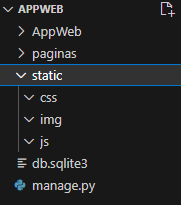

Vamos começar criando em *paginas/templates* um arquivo chamado *modelo.html* e nele vamos colocar:  
	*\<\!DOCTYPE html\>*  
*\<html lang="pt-br"\>*  
*\<head\>*  
*\<meta charset="UTF-8"\>*  
*\<meta name="viewport" content="width=device-width, initial-scale=1.0"\>*  
*\<title\>Modelo\</title\>*  
*\<link rel="stylesheet" href="https://cdn.jsdelivr.net/npm/bootstrap@4.0.0/dist/css/bootstrap.min.css" integrity="sha384-Gn5384xqQ1aoWXA+058RXPxPg6fy4IWvTNh0E263XmFcJlSAwiGgFAW/dAiS6JXm" crossorigin="anonymous"\>*  
*\</head\>*  
*\<body\>*  
*\<h3\>Template de Modelo\</h3\>*  
*\<script src="https://code.jquery.com/jquery-3.2.1.slim.min.js" integrity="sha384-KJ3o2DKtIkvYIK3UENzmM7KCkRr/rE9/Qpg6aAZGJwFDMVNA/GpGFF93hXpG5KkN" crossorigin="anonymous"\>\</script\>*  
*\<script src="https://cdn.jsdelivr.net/npm/popper.js@1.12.9/dist/umd/popper.min.js" integrity="sha384-ApNbgh9B+Y1QKtv3Rn7W3mgPxhU9K/ScQsAP7hUibX39j7fakFPskvXusvfa0b4Q" crossorigin="anonymous"\>\</script\>*  
*\<script src="https://cdn.jsdelivr.net/npm/bootstrap@4.0.0/dist/js/bootstrap.min.js" integrity="sha384-JZR6Spejh4U02d8jOt6vLEHfe/JQGiRRSQQxSfFWpi1MquVdAyjUar5+76PVCmYl" crossorigin="anonymous"\>\</script\>*  
*\</body\>*  
*\</html\>*  
Esses links são os que estão no site do BootStrap, basta copiar e colar. Caso queira testar, você pode ir em views.py e trocar:  
	template\_name \= "index.html"  
para:  
	template\_name \= "modelo.html"  
Atualizando a página inicial. Lembre-se de **desfazer** essa mudança.

**Extra:** Caso queira, você pode acessar os links em *href* e em *src* e baixar os arquivos css e js, adicionando-os na pasta static e importando-os utilizando o Django. Lembre-se de pôr na primeira linha o comando:  
	**  
Também é importante lembrar de salvar os arquivos e usar o mesmo nome na hora da importação. Dessa forma, é possível ter os seguintes arquivos na pasta static:  
	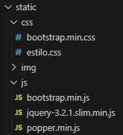  
E um arquivo modelo muito mais "limpo":  
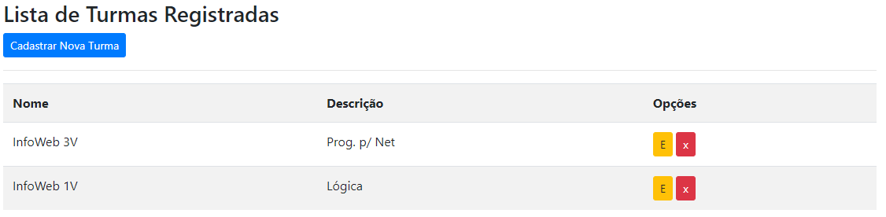

**Importante:** Nós importamos o arquivo css do BootStrap no header (bloco *head*) pois é algo necessário para carregar a página e será importado logo após o título da página ser definido. Os arquivos JavaScript nós importamos apenas na última linha do bloco body, pois, caso contrário, o navegador iria primeiro importar esses arquivos antes de começar a gerar o restante da página. Colocando essas importações por último, garantimos que a página será gerada e o usuário poderá interagir com esta enquanto os JavaScript (e demais arquivos) são importados em segundo plano.

Com a página modelo criada e o BootStrap importado, nós podemos criar um layout inicial e utilizar mais um comando do Django para separar o nosso modelo em blocos:  
	**  
		*…HTML/CSS…*  
	**  
Daí, podemos importar o modelo como um todo em nossas outras páginas e usar o mesmo comando block do Django para editar apenas o que for **diferente** do nosso modelo. Sendo assim, teremos em *modelo.html*:  
*\<\!DOCTYPE html\>*  
*\<html lang="pt-br"\>*  
*\<head\>*  
    *\<meta charset="UTF-8"\>*  
    *\<meta name="viewport" content="width=device-width, initial-scale=1.0"\>*  
    **  
    *\<title\>Modelo\</title\>*  
	**  
    *\<link rel="stylesheet" href="https://cdn.jsdelivr.net/npm/bootstrap@4.0.0/dist/css/bootstrap.min.css" integrity="sha384-Gn5384xqQ1aoWXA+058RXPxPg6fy4IWvTNh0E263XmFcJlSAwiGgFAW/dAiS6JXm" crossorigin="anonymous"\>*  
*\</head\>*  
*\<body\>*  
    **  
    *\<div class="bg-light"\>*  
        *Meu menu*  
    *\</div\>*  
	**

    **  
    *\<div class="bg-secondary"\>*  
        *Figuras de Destaque*  
    *\</div\>*  
	**

    **  
    *\<div class="container"\>*  
        *\<h3\>Template de Modelo\</h3\>*  
        *\<p\>Conteúdo do Site\</p\>*  
    *\</div\>*  
    **

    **  
    *\<div class="bg-light"\>*  
        *Rodapé*  
    *\</div\>*  
    **

    *\<script src="https://code.jquery.com/jquery-3.2.1.slim.min.js" integrity="sha384-KJ3o2DKtIkvYIK3UENzmM7KCkRr/rE9/Qpg6aAZGJwFDMVNA/GpGFF93hXpG5KkN" crossorigin="anonymous"\>\</script\>*  
    *\<script src="https://cdn.jsdelivr.net/npm/popper.js@1.12.9/dist/umd/popper.min.js" integrity="sha384-ApNbgh9B+Y1QKtv3Rn7W3mgPxhU9K/ScQsAP7hUibX39j7fakFPskvXusvfa0b4Q" crossorigin="anonymous"\>\</script\>*  
    *\<script src="https://cdn.jsdelivr.net/npm/bootstrap@4.0.0/dist/js/bootstrap.min.js" integrity="sha384-JZR6Spejh4U02d8jOt6vLEHfe/JQGiRRSQQxSfFWpi1MquVdAyjUar5+76PVCmYl" crossorigin="anonymous"\>\</script\>*  
*\</body\>*  
*\</html\>*  
E podemos substituir o que tem no arquivo *index.html* por:  
	**  
**

**  
*\<title\>Página Inicial\</title\>*  
**

**  
*\<div class="container"\>*  
    *\<h1\>Página Inicial\</h1\>*  
    *\*  
*\</div\>*  
**  
Agora, se executarmos nossa aplicação novamente, devemos ter algo como isso na página inicial:  
	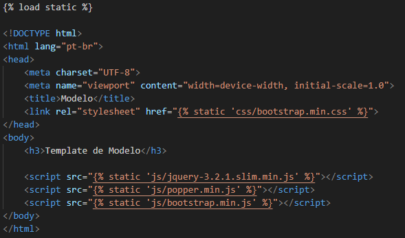  
Lembrando que o logo foi importado e é uma imagem da pasta static/img de nome *logo.png*.

Agora vamos criar mais uma página e digamos que não queremos que o bloco *destaques* apareça nela. Primeiro vamos em *views.py* para adicionar:  
	*class SobreView(TemplateView):*  
*template\_name \= "sobre.html"*  
Em *paginas/urls.py* vamos editar o *import* para:  
	*from .views import IndexView, SobreView*  
E adicionar em *urlpatterns*:  
	*path('sobre/', SobreView.as\_view(), name='sobre'),*  
Por fim, vamos criar na pasta *templates* o arquivo *sobre.html* e pôr:  
	**

**  
*\<title\>Sobre o Projeto\</title\>*  
**

**

**

**  
*\<div class="container"\>*  
    *\<h3\>Sobre o Sistema\</h3\>*  
    *\<p\>Esta página vai descrever nosso projeto.\</p\>*  
*\</div\>*  
**  
Para ver o resultado, podemos acessar a nova página no link:  
	*http://127.0.0.1:8000/sobre/*

**Importante:** Caso você vá usar alguma importação do Django (**) na página, lembre de colocar na segunda linha, logo após o *extends*:  
	**  
O *load static* **NÃO** é importado pelo *extends*.

Agora, vamos editar o bloco menu para algo mais estético utilizando um modelo BootStrap. Eu vou pegar o primeiro modelo do link abaixo, copiar e colar em *modelo.html*, substituindo o que há no bloco menu.  
	https://getbootstrap.com/docs/4.0/components/navbar/  
Eu vou deletar o botão Navbar, por questão de preferência (*\<a class … /button\>*), e vou copiar todo o bloco do elemento *Home* e colar uma cópia no fim da lista (após Disabled). Também vou trocar os textos com *Home* pôr *Início* e *Sobre*.  
	**  
*\<nav class="navbar navbar-expand-lg navbar-light bg-light"\>*  
*\<div class="collapse navbar-collapse" id="navbarSupportedContent"\>*  
*\<ul class="navbar-nav mr-auto"\>*  
*\<li class="nav-item active"\>*  
*\<a class="nav-link" href="\#"\>Início \<span class="sr-only"\>(current)\</span\>\</a\>*  
*\</li\>*  
*…*  
*\<li class="nav-item active"\>*  
*\<a class="nav-link" href="\#"\>Sobre\</a\>*  
*\</li\>*  
*\</ul\>*  
			*…*  
*\</div\>*  
*\</nav\>*  
**  
Se eu recarregar minha página web, terei isso como menu de navegação:  
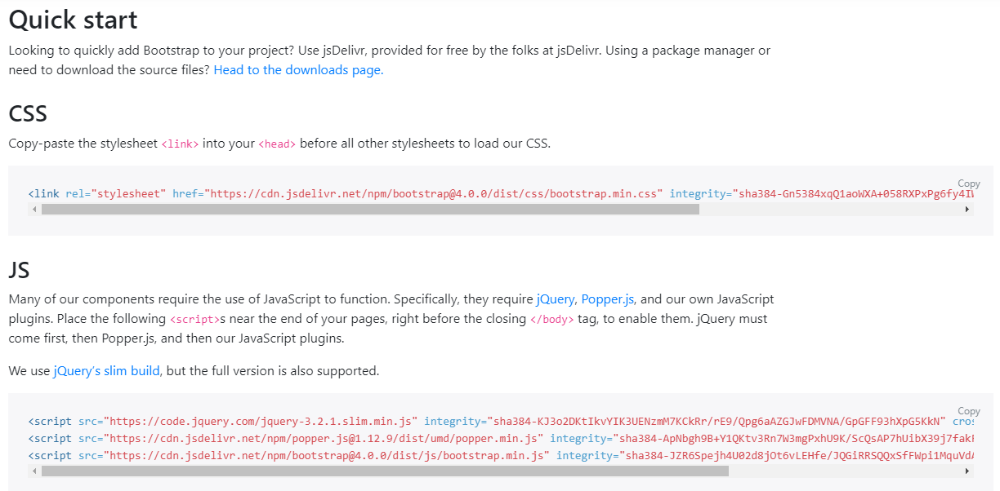  
Apesar de visualmente pronto, os links ainda não funcionam, pois não configuramos para onde cada link irá redirecionar o usuário. Para isso, no campo *href* do link Início e Sobre vamos substituir o símbolo \# de cada um por, respectivamente:  
	**  
	**  
Com isso, devemos conseguir alternar entre as duas páginas criadas, *index.html* e *sobre.html*, utilizando os links do menu de navegação.

**Importante:** Os nomes *'inicio'* e *'sobre'* usados na importação do link vem do arquivo *paginas/urls.py*:  
	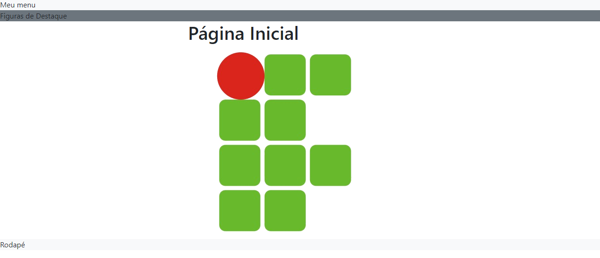

**Models e Banco de Dados:**  
Começaremos agora a interagir com o banco de dados e, para isso, usaremos os *models* do Django. Mas antes, vamos criar um novo módulo exclusivamente para lidar com essa interação com o BD e manter o nosso código organizado. Para isso, basta digitar no terminal:  
	*python manage.py startapp **cadastros***  
Você pode dar o nome que quiser para o módulo, mas para este projeto chamarei este módulo de **cadastros**.

Assim como fizemos no módulo páginas, vamos criar na pasta cadastros o arquivo *urls.py* e a pasta *template*, que usaremos em breve. Dessa forma, devemos ter na pasta cadastros:  
	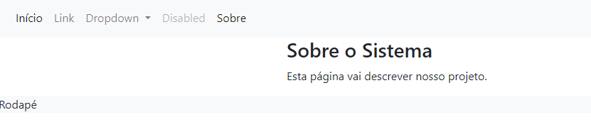  
Também precisamos ir em *settings.py* e adicionar na última linha de *INSTALLED\_APPS*:  
	*'cadastros.apps.CadastrosConfig',*  
Após essa configuração inicial, vamos abrir o arquivo *cadastros/models.py*. É nele que vamos definir as classes que serão criadas no banco de dados. Para este projeto, vou criar duas classes. A primeira será **Turma** e a segunda será **Atividade**. Esta última será associada a uma Turma já existente. O arquivo *cadastros/models.py* ficará assim:  
*from django.db import models*

*class Turma(models.Model):*  
*nome \= models.CharField(max\_length=50)*  
*descricao \= models.CharField(max\_length=150, verbose\_name="Descrição")*

*def \_\_str\_\_(self):*  
*return "{} ({})".format(self.nome, self.descricao)*

*class Atividade(models.Model):*  
*numero \= models.IntegerField(verbose\_name="Número")*  
*descricao \= models.CharField(max\_length=150, verbose\_name="Descrição")*  
*pontos \= models.DecimalField(decimal\_places=1, max\_digits=4)*  
*detalhes \= models.CharField(max\_length=150)*

*turma \= models.ForeignKey(Turma, on\_delete=models.PROTECT)*

*def \_\_str\_\_(self):*  
*return "{} \- {} ({})".format(self.numero, self.descricao, self.turma.nome)*  
Ao criar uma classe, usamos o *models* do Django como base para que ele lide com algumas coisas para nós, facilitando o nosso trabalho. Se olhar atentamente, verá que não precisei definir o ID (*ou PrimaryKey, PK*) para nenhuma das duas classes, pois o Django já irá lidar com isso para nós.

Outra coisa importante são os tipos de dados. Eu utilizei Char, Integer e DecimalField, que representam texto, inteiro e decimal, mas existem dezenas de outros tipos. Para mais informações desses tipos e dos outros, você pode acessar o link oficial do Django:  
	https://docs.djangoproject.com/en/4.2/ref/models/fields/  
Ou então acessar essa versão em português:  
	https://developer.mozilla.org/pt-BR/docs/Learn/Server-side/Django/Models  
Também utilizei *'ForeignKey*' no atributo turma. A tradução seria Chave Estrangeira e indica que é um dado que vem de outra classe (nesse caso, a classe Atividade usando algo da classe Turma).

Ainda no ForeignKey, mesma linha, há o *'on\_delete=models.PROTECT'*. Como a Atividade está sendo associada a uma Turma, esse 'on\_delete' indica o que irá acontecer com uma Atividade caso a Turma a qual ela está associada seja deletada. Utilizando *PROTECT*, a turma **não** pode ser deletada até que nenhuma Atividade esteja associada a ela.  
Outras opções comuns são CASCADE, onde a Atividade também seria deletada; SET\_NULL, onde o *campo turma* da Atividade seria substituído por NULL (Nulo); e o DO\_NOTHING, onde o *campo turma* da Atividade seria substituído por "vazio" ().

Por fim, temos o *def \_\_str\_\_*. Em breve, veremos que podemos pedir para que o Django imprima uma classe do banco para nós, mas, por padrão, ele iria imprimir algo como:  
	*object (1)*  
	*object (2)*  
Por isso, definimos a função e damos uma formatação que nos seja mais interessante. Da forma que foi definido, as Turmas serão impressas como:  
	*Nome (Descrição)*  
E as Atividades como:  
	*Número \- Descrição (Nome da Turma)*

Após as classes serem definidas, precisamos adicioná-las ao banco. Para isso, vamos digitar no terminal os seguintes comandos:  
	*python manage.py makemigrations*  
	*python manage.py migrate*  
Por fim, vamos fazer as classes aparecerem na página admin. Isso vai nos permitir interagir com elas imediatamente. Para isso, vamos abrir o arquivo *cadastros/admin.py* e pôr:  
*from django.contrib import admin*  
*from .models import Turma, Atividade*

*\# Register your models here.*  
*admin.site.register(Turma)*  
*admin.site.register(Atividade)*  
Com isso, devemos conseguir acessar o link admin e ver nossas classes.  
	*http://127.0.0.1:8000/admin*  
	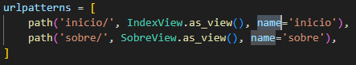

Pelo link admin, já conseguimos realizar o **CRUD** completo. CRUD sendo referente as quatro operações realizadas numa classe do banco de dados:  
*Create		\-	Criar*  
*Read		\-	Ler/Listar*  
*Update		\-	Atualizar*  
*Delete		\-	Deletar*  
No entanto, não queremos que os usuários tenham acesso à página admin. Portanto, iremos criar quatro páginas (uma para cada operação) de forma a dar aos usuários acesso aos dados do Banco de Dados. Dessa vez, iremos utilizar o **Views** do Django, o qual fará a maior parte do serviço para nós.

Vamos começar com o **Create**. Em *cadastros/views.py* vamos colocar:  
*from django.views.generic.edit import CreateView*  
*from django.urls import reverse\_lazy*  
*from .models import Turma, Atividade*

*\# Create*  
*class TurmaCreate(CreateView):*  
*model \= Turma*  
*fields \= \['nome', 'descricao'\]*  
*template\_name \= 'form.html'*  
*success\_url \= reverse\_lazy('inicio')*

*class AtividadeCreate(CreateView):*  
*model \= Atividade*  
*fields \= \['numero', 'descricao', 'pontos', 'detalhes', 'turma'\]*  
*template\_name \= 'form.html'*  
*success\_url \= reverse\_lazy('inicio')*  
Para cada classe, precisamos definir quatro informações: o *model* a qual ele pertence, utilizando o mesmo nome que usamos em *cadastros/models.py*; os campos (*fields*) que irão aparecer para o usuário preencher ao criar uma entidade dessa classe; o template que será usado (esse arquivo HTML ainda será criado e usaremos o mesmo template para as duas classes); e para onde o usuário será encaminhado ao obter um sucesso no cadastro. Por enquanto, vamos encaminhá-lo de volta para a página inicial.

Além da página que será usada (form.html), também precisamos definir o endereço de cada view. Para isso, vamos abrir o arquivo *cadastros/urls.py* e digitar:  
*from django.urls import path*  
*from .views import TurmaCreate, AtividadeCreate*

*urlpatterns \= \[*  
*path('cadastrar/turma/', TurmaCreate.as\_view(), name='cadastrar-turma'),*  
*path('cadastrar/atividade/', AtividadeCreate.as\_view(), name='cadastrar-atividade'),*  
*\]*  
Também precisamos adicionar esses caminhos ao arquivo urls.py do projeto. Em *urlpatterns*, vamos adicionar na última linha:  
	*path('', include('cadastros.urls')),*  
	*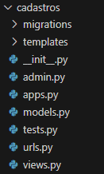*  
Como deixamos esse último link vazio (''), o endereço para os cadastros serão:  
	*http://127.0.0.1:8000/cadastrar/turma/*  
	*http://127.0.0.1:8000/cadastrar/atividade/*  
Agora vamos criar o arquivo *form.html* dentro da pasta *cadastros/templates*. Vamos usar como base para este HTML o mesmo modelo que criamos anteriormente, alterando apenas o título e o conteúdo da página.  
**  
**

**  
*\<title\>Cadastro\</title\>*  
**

**  
*\<div class="container"\>*  
*\<h3\>Cadastro\</h3\>*  
*\<p class="lead"\>Preencha todos os campos obrigatórios:\</p\>*

*\<hr\>*

*\<form action="" method="POST"\>*  
**

*{{ form.as\_p }}*

*\<button type="submit" class="btn btn-primary"\>Cadastrar\</button\>*  
*\</form\>*  
*\</div\>*  
**  
Temos um HTML simples com um *form* convencional. Contudo, dentro do *form* estamos utilizando o Django e deixando que ele faça basicamente tudo por nós. O *csrf\_token* é algo do próprio Django utilizado para averiguar e assegurar contra certos malwares e ataques maliciosos contra o sistema e o *button submit* serve para enviar o formulário para o servidor.  
Quando declaramos a classe *TurmaCreate*, indicamos ao Django o modelo que seria usado (Turma), assim como os campos (fields) que deveriam ser preenchidos. Assim, quando esta página for gerada, junto a ela terá associado esses dados. Dessa forma, ao usarmos o *form.as\_p*, o Django irá formatar todos os campos como um parágrafo. Além disso, o Django também irá validar os dados para nós.  
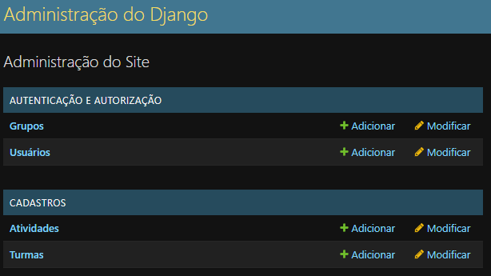

**Extra:** É possível utilizar o *django-crispy-forms* para formatar os formulários. Para isso, precisamos realizar apenas alguns simples passos. Primeiro, vamos instalá-lo (caso já não tenha).  
	*pip install django-crispy-forms*  
	*pip install crispy-bootstrap4*  
Agora vamos em *settings.py*. Em *INSTALLED\_APPS*, vamos adicionar no fim:  
	*INSTALLED\_APPS \= \[*  
		*…,*  
		*'crispy\_forms',*  
		*'crispy\_bootstrap4',*  
	*\]*  
	  
	*CRISPY\_TEMPLATE\_PACK \= 'bootstrap4'*  
Apenas para confirmar, o *crispy\_forms* e o *crispy\_bootstrap4* ficará **dentro** do *INSTALLED\_APPS* e o *crispy\_template\_pack* ficará **fora**. Com isso, podemos retornar à nossa página HTML e adicionar logo após o *load static*:  
	**  
e trocar *form.as\_p* por:  
	*{{ form|crispy }}*  
Atenção para o símbolo usado. É uma barra vertical | e não inclinada como \\ ou /. Com o crispy, teremos:  
	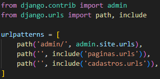

Agora que terminamos o cadastro, vamos para o Update. A lógica é a mesma de antes. Vamos começar editando *cadastros/views.py*. Vamos adicionar o UpdateView ao import:  
	*from django.views.generic.edit import CreateView, **UpdateView***  
E criar mais duas classes para o Update, uma para cada classe no banco.  
*\# Update*  
*class TurmaUpdate(UpdateView):*  
*model \= Turma*  
*fields \= \['nome', 'descricao'\]*  
*template\_name \= 'form.html'*  
*success\_url \= reverse\_lazy('inicio')*

*class AtividadeUpdate(UpdateView):*  
*model \= Atividade*  
*fields \= \['numero', 'descricao', 'pontos', 'detalhes', 'turma'\]*  
*template\_name \= 'form.html'*  
*success\_url \= reverse\_lazy('inicio')*  
Mudamos apenas os nomes das classes e o parâmetro (*UpdateView*), deixando o resto idêntico a antes. Mesmo modelo, mesmos campos e até o mesmo HTML usado. Agora vamos em *cadastros/urls.py*. Vamos adicionar as duas classes que acabamos de criar ao import. Você pode manter tudo na mesma linha, dessa forma:  
*from .views import TurmaCreate, AtividadeCreate, TurmaUpdate, AtividadeUpdate*  
Ou separar cada "tipo" de classe em uma linha, para ficar melhor de visualizar.  
*from .views import TurmaCreate, AtividadeCreate*  
*from .views import TurmaUpdate, AtividadeUpdate*  
Eu usarei o segundo exemplo por ser mais didático, mas ambos estão corretos.  
Por fim, vamos adicionar em *urlpatterns* os caminhos:  
	path('editar/turma/\<int:pk\>/', TurmaUpdate.as\_view(), name='editar-turma'),  
path('editar/atividade/\<int:pk\>/', AtividadeUpdate.as\_view(), name='editar-atividade'),  
Aqui temos uma diferença do que fizemos para o Create, que seria esse *'\<int:pk\>'*. Isso porque precisamos saber qual item do banco de dados estamos editando e, para isso, usaremos o PK (PrimaryKey, Chave Primária ou ID) que é criado automaticamente pelo Django. E é isso\! Se acessarmos os links a seguir, já devemos ser capazes de editar os cadastros realizados anteriormente:  
	*http://127.0.0.1:8000/editar/turma/1/*  
	*http://127.0.0.1:8000/editar/atividade/1/*  
Detalhe que o número no fim deve ser igual ao PK (ID) de uma turma/atividade existente. Caso coloque um PK inexistente, a página dará erro.

Vamos ao Delete. Em cadastros/views.py, vamos adicionar o DeleteView ao import.  
	from django.views.generic.edit import CreateView, UpdateView, **DeleteView**  
e no fim vamos adicionar mais duas classes:  
*\# Delete*  
*class TurmaDelete(DeleteView):*  
*model \= Turma*  
*template\_name \= 'form-excluir.html'*  
*success\_url \= reverse\_lazy('inicio')*

*class AtividadeDelete(DeleteView):*  
*model \= Atividade*  
*template\_name \= 'form-excluir.html'*  
*success\_url \= reverse\_lazy('inicio')*  
Dessa vez não vamos precisar definir os campos (fields) e vamos criar outro HTML para a exclusão de um item no Banco de Dados. Agora vamos em *cadastros/urls.py* para criar os caminhos de cada um. Vamos adicionar ao *import*.  
	*from .views import TurmaDelete, AtividadeDelete*  
E por fim adicionar os caminhos em *urlpatterns*:  
	*path('excluir/turma/\<int:pk\>/', TurmaDelete.as\_view(), name='excluir-turma'),*  
*path('excluir/atividade/\<int:pk\>/', AtividadeDelete.as\_view(), name='excluir-atividade'),*  
Assim como no Update, vamos usar o *pk* no link para definir qual item iremos excluir.  
Resta apenas criar o arquivo *form-excluir.html* em *cadastros/template*. Ele será quase uma cópia do *form.html*, alterando os textos e o conteúdo do *form*.  
**  
**

**  
*\<title\>Excluir\</title\>*  
**

**  
*\<div class="container"\>*  
*\<h3\>Excluir Registro\</h3\>*  
*\<p class="lead"\>Confirme para excluir o registro definitivamente.\</p\>*

*\<hr\>*

*\<form action="" method="POST"\>*  
**

*\<p\>Deseja excluir o registro: \<b\>{{ object }}\</b\>?\</p\>*

*\<button type="submit" class="btn btn-danger"\>Excluir\</button\>*  
*\</form\>*  
*\</div\>*  
**  
Ao invés de usar *form.as\_p* ou *form|crispy*, iremos apenas "imprimir" o objeto, lembrando que o django seguirá a formatação que colocamos na definição da função \_\_str\_\_ quando criamos as classes. Podemos testar acessando os links:  
	*http://127.0.0.1:8000/excluir/turma/1/*  
	*http://127.0.0.1:8000/excluir/atividade/1/*  
Atenção ao PK (ID) no final.

Por fim, vamos ao Listar, completando assim o CRUD do banco de dados. Em *cadastros/views.py*, vamos adicionar o import:  
	from django.views.generic.edit import CreateView, UpdateView, DeleteView  
	**from django.views.generic.list import ListView**  
**Atenção:** Esse import é diferente dos demais e, portanto, ficará em uma nova linha.  
Ainda em *cadastros/views.py*, vamos criar as duas classes no fim:  
*\# List*  
*class TurmaList(ListView):*  
*model \= Turma*  
*template\_name \= 'listas/turma.html'*

*class AtividadeList(ListView):*  
*model \= Atividade*  
*template\_name \= 'listas/atividade.html'*  
Dessa vez, iremos criar um HTML para cada classe, isso porque definiremos em cada um como a lista será mostrada para o usuário. Por causa disso, não precisamos definir os campos (fields). Também não será necessário definir o *success\_url*, já que ao listar o site ficará no HTML da própria lista.  
Em cadastros/urls.py, vamos criar os links. Primeiro importamos as classes:  
	*from .views import TurmaList, AtividadeList*  
E em urlpatterns adicionamos os caminhos no fim:  
*path('listar/turmas/', TurmaList.as\_view(), name='listar-turmas'),*  
*path('listar/atividades/', AtividadeList.as\_view(), name='listar-atividades'),*  
Resta criar os HTMLs. Por questão de organização, já que cada classe no banco terá seu próprio HTML, colocarei esses arquivos em uma pasta separada. Para isso, em *cadastros/templates* eu criarei a pasta *lista* e, dentro dessa pasta, os dois arquivos HTML. Assim, teremos na pasta *cadastros*:  
	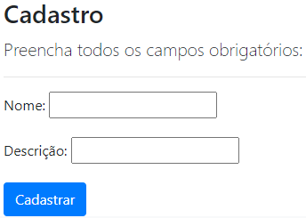  
Mais uma vez usarei o *modelo.html* como base, alterando apenas o necessário para a nova página. Começando com *turma.html*, a ideia é listar as turmas em uma tabela com três colunas: Nome, Descrição e Opções. Onde em Opções terá um link para editar e outro para excluir o item. Também irei adicionar um link para cadastrar uma nova turma. Assim, não precisaremos mais ficar digitando os links por extenso na barra de navegação. Com uma pitada de BootStrap, teremos:  
**  
**

**  
*\<title\>Turmas\</title\>*  
**

**  
*\<div class="container"\>*  
*\<h3\>Lista de Turmas Registradas\</h3\>*  
*\<a href="" class="btn btn-primary btn-sm"\>Cadastrar Nova Turma\</a\>*

*\<hr\>*

*\<div class="table-responsive"\>*  
*\<table class="table table-striped"\>*  
*\<tr\>*  
*\<th\>Nome\</th\>*  
*\<th\>Descrição\</th\>*  
*\<th\>Opções\</th\>*  
*\</tr\>*

**  
*\<tr\>*  
*\<td\>{{ turma.nome }}\</td\>*  
*\<td\>{{ turma.descricao }}\</td\>*  
*\<td\>*  
*\<a href="" class="btn btn-warning btn-sm" title="Editar"\>E\</a\>*  
*\<a href="" class="btn btn-danger btn-sm" title="Excluir"\>x\</a\>*  
*\</td\>*  
*\</tr\>*  
**  
*\<tr\>*  
*\<td colspan="3"\>Nenhuma turma registrada.\</td\>*  
*\</tr\>*  
**  
*\</table\>*  
*\</div\>*  
*\</div\>*  
**  
Temos algumas novidades nesse arquivo.  
	*table-responsive table table-striped* \- Vem do BootStrap, uma tabela responsiva (mudará de tamanho de acordo com a tela onde estiver sendo visualizada) onde as linhas alternam de cor (striped).  
	** \- Lembra que o Django mantém algumas informações associadas à página a depender do que definimos em views.py? Usando o ListView, o Django terá um *'object\_list'* com todas as turmas e daí podemos usar um *FOR* para realizar algo para cada item. O que fizemos foi adicionar uma linha para cada item da lista, dispondo Nome, Descrição e os links para editar e excluir o item.  
	** \- Usamos o django para definir um link, usando o nome especificado no arquivo urls.py.  
	** \- Aqui, além do link, colocamos *turma.pk*. O que isso faz é indicar ao django para acrescentar o PK(ID) do item ao fim do link. Assim saberemos qual item deve ser editado/excluido.  
	** \- É para o caso da lista estar vazia (nenhum cadastro). Nesse caso, o texto *'Nenhuma turma registrada'* será impresso na tabela.  
	** \- Para indicar o fim do *FOR*, mesma ideia do *endblock*.

Acessando a página, devemos ter algo como:  
	*http://127.0.0.1:8000/listar/turmas/*  


E, com isso, concluímos o CRUD completo para a classe Turma do nosso banco de dados. Se adicionarmos o link dessa página na nossa página inicial (assim como Início e Sobre), poderemos navegar por todo o site sem precisar digitar nenhum link.  
**Extra:** Agora que temos nossa página de listagem, podemos ir no arquivo *cadastros/views.py* e alterar todos os *success\_url* das classes Turma para:  
	*success\_url \= reverse\_lazy('listar-turmas')*  
Fazendo com que após criar, editar ou excluir uma turma, o usuário retorne para a página de listagem de turmas.

O passo seguinte seria criar a página *atividade.html*, usando a mesma ideia do *turma.html*, apenas alterando os dados mostrados na tela para cada atividade. Isso ficará como uma Atividade para vocês\!
