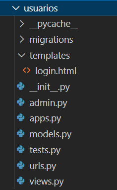

**Criação de um novo módulo**

Antes de começarmos com a parte de autenticação do sistema, vamos criar um novo módulo para manter o projeto organizado. Para isso, vamos pôr no terminal:  
	*python manage.py startapp usuarios*  
Será criada uma nova pasta com um conjunto de arquivos, assim como aconteceu quando criamos o módulo páginas e o módulo cadastros. Na pasta usuários, vamos criar:  
	Um arquivo chamado:		*urls.py*  
Uma pasta:			*templates*  
E dentro desta pasta:		*login.html*  
Você deve ter algo como isso:  
  
Agora vamos no arquivo *settings.py* na pasta do projeto e vamos procurar por *INSTALLED\_APPS*. Dentro dos colchetes, vamos adicionar na última linha:  
	*'usuarios.apps.UsuariosConfig',*  
Por fim, ainda na pasta do projeto, vamos abrir o arquivo urls.py e nele adicionar na última linha de urlpatterns:  
	*path('', include('usuarios.urls')),*  
Com isso feito, temos nosso módulo criado e configurado e podemos finalmente começar a criar a parte de Autenticação.

**Login e Logout**

Vamos começar abrindo o arquivo *urls.py* da pasta *usuários*, que deve estar vazio no momento. Nele, vamos colocar:  
*from django.urls import path*  
*from django.contrib.auth import views as auth\_views*

*urlpatterns \= \[*  
    *path('login/', auth\_views.LoginView.as\_view(*  
        *template\_name='login.html'*  
    *), name='login'),*  
      
    *path('logout/', auth\_views.LogoutView.as\_view(),*  
        *name='logout'),*  
*\]*  
Dessa vez não precisamos criar as views, pois vamos usar uma do próprio django. Precisamos apenas definir o template que será utilizado, que será o arquivo *login.html* que criamos antes e que iremos definir a seguir. Então, em *usuarios/templates*, vamos abrir o arquivo *login.html* e colocar:  
	**

**

**  
*\<title\>Autenticação\</title\>*  
**

**  
*\
*  
    *\<h3\>Autenticação\</h3\>*

    *\<hr\>*

    *\<form action="" method="post"\>*  
        **

        *{{ form.as\_p }}*

        *\<button type="submit" class="btn btn-primary"\>*  
            *Entrar*  
        *\</button\>*  
    *\</form\>*  
*\</div\>*  
**  
Esse código é uma cópia do arquivo *form.html*, alterando apenas o título e o texto do botão. Está quase pronto, mas se você acessar a página e logar, verá que dará erro, pois será encaminhado para um endereço inexistente. Esse endereço é um padrão do Django, mas temos como alterar isso. Para isso, vamos voltar no arquivo *settings.py* do projeto e vamos adicionar na última linha:  
	*LOGIN\_URL \= 'login'*  
*LOGIN\_REDIRECT\_URL \= 'inicio'*  
*LOGOUT\_REDIRECT\_URL \= 'login'*  
O que estamos fazendo aqui é informando que a página que será usada para o Login é a página *'login'*, ao efetuar um login o usuário será redirecionado (redirect) para a página *'início'* e ao efetuar um logout será redirecionado para a página *'login'*. Com isso, o login do usuário está pronto e funcional.

Vamos agora adicionar a opção de logout. Para isso, não precisamos criar uma página inteira, como fizemos no login. Vamos precisar apenas de um botão/link com a opção de logout e, quando o usuário clicar, será redirecionado de volta para a página de login (que definimos a pouco). Então, em *paginas/templates/modelo.html*, pois quero que essa opção esteja disponível em todas as páginas, vou adicionar ao menu do *navbar* (após o último *LI*, mas antes do *UL*):  
  
            \<li class="nav-item active"\>  
              \<a class="nav-link" href=""\>Logout\</a\>  
            \</li\>  
              
            \<li class="nav-item active"\>  
              \<a class="nav-link" href=""\>Login\</a\>  
            \</li\>  
              
Utilizamos o django para poder usar um IF e nele definimos dois links: Caso o usuário esteja autenticado, irá ver um link para logout. Caso contrário, irá ver um link para login.  
**Extra:** Caso queira informar o nome do usuário em algum lugar na página, você pode usar:  
	*{{ request.user }}*

**Autenticação**

No momento, o usuário consegue logar e deslogar no sistema, mas isso não implica em nada, pois mesmo deslogado o usuário consegue ver todas as páginas. Vamos mudar isso\! Em *cadastros/views.py*, vamos importar:  
	*from django.contrib.auth.mixins import LoginRequiredMixin*  
e **adicionar em cada view** que for necessário login para visualização (ex.: TurmaCreate):  
	*class TurmaCreate(**LoginRequiredMixin**, CreateView):*  
***login\_url \= reverse\_lazy('login')***  
*model \= …*  
Em negrito está o que foi adicionado à classe. Lembrando que é necessário realizar isso para todas as views necessárias. Agora, caso algum usuário não logado tente acessar essa página, ele será redirecionado à página de login.  
**Extra:** Caso você queira limitar uma página a um grupo de usuários (Ex.: professores, funcionários, administrador…), ao invés de utilizar o *LoginRequiredMixin*, você pode utilizar o *GroupRequiredMixin*. Para isso, primeiro se importa:  
	*from braces.views import GroupRequiredMixin*  
Lembrando que isso vem do django-braces, ou seja, caso já não tenha importado, importar pelo terminal usando:  
	pip install django-braces  
E adicionar em cada classe necessária:  
	*class AtividadeCreate(**GroupRequiredMixin**, CreateView):*  
***group\_required \= u"Professor"***  
***login\_url \= reverse\_lazy('login')***  
*model \= …*  
Os grupos podem ser criados pela página admin e, caso queira colocar mais de um grupo, basta usar uma lista como no campo fields. Ex.:  
		*group\_required \= \[u"Administrador", u"Professor"\]*

Caso queira, você pode adicionar uma mensagem para o usuário quando ele for redirecionado para a tela de login. Para isso, vamos trocar o que há no bloco conteúdo no arquivo *usuarios/login.html* por:  
	**  
*\
*  
    **  
    *\<h3\>Ação não permitida\!\</h3\>*  
    *\<hr\>*  
    *\
*  
        *\<b\>Houve algum problema para processar a ação desejada ou você não tem permissão para realizar a ação.\</b\>*  
    *\</p\>*  
    **  
    *\<h3\>Autenticação\</h3\>*

    *\<hr\>*

    *\<form action="" method="post"\>*  
        **

        *{{ form.as\_p }}*

        *\<button type="submit" class="btn btn-primary"\>*  
            *Entrar*  
        *\</button\>*  
    *\</form\>*  
    **  
*\</div\>*  
**  
Dessa forma, utilizamos a mesma página para dois propósitos diferentes.

Agora, apenas usuários cadastrados conseguem visualizar os dados sensíveis do site. Contudo, qualquer usuário consegue visualizar os dados de todos os usuários. Para alterar isso, precisamos criar uma relação entre os usuários e os registros criados por ele, de forma que depois possamos filtrar os registros para que o usuário possa apenas ver/editar/excluir os registros que ele próprio criou. 

Vamos começar criando a relação usuário-registro. Em *cadastros/models.py*, vamos importar:  
*from django.contrib.auth.models import User*  
Para cada classe que for necessário, adicionar como atributo:  
*usuario \= models.ForeignKey(User, on\_delete=models.PROTECT)*  
Como as classes foram alteradas, precisamos atualizar o banco de dados. Para isso, vamos digitar no terminal:  
*python manage.py makemigrations*  
Caso já haja algum cadastro no banco de dados, será necessário definir um padrão "default" para os registros já cadastrados. Para isso, vamos digitar 1 (primeira opção) e vamos definir como padrão 1 (ID do primeiro usuário criado). Em seguida, vamos por no terminal:  
*python manage.py migrate* 

Agora precisamos configurar como o usuário será associado ao registro automaticamente. Vamos em *cadastros/views.py* e, para cada classe **Create** que for necessária, vamos adicionar:  
*class…*   
*…*  
*success\_url…* 

*def form\_valid(self, form):*  
*form.instance.usuario \= self.request.user*  
*url \= super().form\_valid(form)*  
*return url*  
O Django chama essa função *form\_valid* automaticamente, executando as duas últimas linhas por padrão. O que fizemos foi definir *(def)* uma outra versão dessa função, adicionando a primeira linha, onde o ID do usuário logado será adicionado no campo *usuario* do registro.  
**Extra:** Caso queira, é possível modificar os dados recebidos pelo usuário após a validação (linha url \= ...). Vamos, por exemplo, adicionar o texto "\[Teste\]" no fim da descrição. Para isso, colocaríamos antes do *return*:  
*self.object.descricao \+= "\[Teste\]"*   
*self.object.save()*  
*return url*

Agora precisamos filtrar os registros na listagem, para que o usuário veja apenas os registros que ele criou. Para isso, vamos modificar as classes **List**, adicionando no fim das classes:  
*class…*   
*…*  
*template\_name…* 

*def get\_queryset(self):*  
*self.object\_list \= Turma.objects.filter(usuario \= self.request.user)*  
*return self.object\_list*  
Assim como o form\_valid, o Django chama automaticamente o *get\_queryset*, onde o padrão seria *…objects.all* . Ao invés disso, filtramos (filter) os registros pelo ID do usuário logado. 

Agora resta configurar as classes **Update** e **Delete** para que apenas o usuário que criou o registro possa editar/excluí-lo. Para isso, vamos adicionar no fim de cada classe **Update e Delete**:  
*class…*   
*…*  
*success\_url…* 

*def get\_object(self, query=None):*  
*self.object \= Turma.objects.get(pk \= self.kwargs\['pk'\], usuario \= self.request.user)*  
*return self.object*  
Usamos o *kwargs\['pk'\]* para pegar o ID do registro do endereço e pegamos o objeto (get) apenas se ele tiver este ID e se o usuário que o criou for o mesmo que está logado no sistema.

**Extra:** No momento, caso o usuário tente editar ou excluir um registro que ele não criou, ele receberá um erro de permissão. Dessa forma, ele vai saber que existe um registro com aquele ID específico. Para ter  uma solução mais elaborada, é possível alterar o erro recebido para um 404 (página não encontrada). Para isso, ainda em *cadastros/views.py*, vamos importar:  
*from django.shortcuts import get\_object\_or\_404*  
E vamos editar a função *get\_object* das classes **Update** e **Delete** para:  
*def get\_object(self, query=None):*  
*self.object \= get\_object\_or\_404(Turma, pk \= self.kwargs\['pk'\], usuario \= self.request.user)*  
*return self.object*

**Enviar dados para Template**

É possível enviar informação das nossas views para os nossos templates (HTML), como o título das páginas, por exemplo. Para isso, primeiro precisamos definir essas informações nas nossas views (ex.: cadastros/views.py, classe TurmaCreate) .  
*class…*   
*…*  
*success\_url…* 

*def get\_context\_data(self, \*args, \*\*kwargs):*  
*context \= super().get\_context\_data(\*args, \*\*kwargs)*  
*context\['Titulo'\] \= "Cadastro de Turmas"*   
*return context*  
Daí, no template html (ex.: form.html), podemos pegar essa informação com as chaves duplas:  
    \<h3\>{{ Titulo }}\</h3\>  
**Atenção:** O único "problema" de enviar os dados para o template é que você deve configurar o *context* para todas as views que usam aquele template, caso contrário não irá aparecer nada ao usar as chaves duplas.

**Cadastro de Usuário**

O usuário já está funcional, com login, logout e relação entre ele e os seus registros. Falta agora disponibilizar ao usuário uma tela de cadastros, já que no momento só é possível criar um novo usuário pela página do admin. Para isso, vamos em *usuarios/views.py* e vamos digitar:  
*from django.views.generic.edit import CreateView*  
*from django.contrib.auth.models import User*  
*from django.urls import reverse\_lazy*

*class UsuarioCreate(CreateView):*  
*model \= User*  
*fields \= \['username', 'email', 'password'\]*  
*template\_name \= 'form.html'*  
*success\_url \= reverse\_lazy('login')*  
E em usuarios/urls.py, vamos adicionar em *urlpatterns* o endereço desta página:  
*path('registrar/', UsuarioCreate.as\_view(), name='registrar'),*  
Já é possível acessar o endereço e testar a página de registro. No momento, o e-mail não é obrigatório e o campo Senha só aparece uma vez, mas desejo alterar isso para o padrão mais comum, onde o endereço é obrigatório e o campo Senha aparece duas vezes para confirmação.   
Então, na pasta usuarios, nós vamos criar um novo arquivo, o qual ainda não utilizamos, chamado **forms.py**. Nesse arquivo nós iremos configurar o formulário padrão do Django para ficar do nosso "agrado". Nesse arquivo, vamos colocar:  
*from django import forms*  
*from django.contrib.auth.models import User*  
*from django.contrib.auth.forms import UserCreationForm*

*class UsuarioForm(UserCreationForm):*  
*email \= forms.EmailField(max\_length=100)*  
*class Meta:*  
*model \= User*  
*fields \= \['username', 'email', 'password1', 'password2'\]*  
E, de volta para o *usuarios/views.py*, vamos modificá-lo para:  
*from django.views.generic.edit import CreateView*  
*~~from django.contrib.auth.models import User~~*  
*from django.urls import reverse\_lazy*  
***from .forms import UsuarioForm***

*class UsuarioCreate(CreateView):*  
***form\_class \= UsuarioForm***  
*~~model \= User~~*  
*~~fields \= \['username', 'email', 'password'\]~~*  
*template\_name \= 'form.html'*  
*success\_url \= reverse\_lazy('login')*  
Em negrito está o que adicionamos e em tachado (~~texto~~) está o que vamos remover. O motivo de removermos essas três linhas é porque elas já estão no arquivo forms, que importamos. Agora resta colocar um link no menu do navbar para a página de registro e está pronto.   
**Adicionar usuário em grupos**

Em alguns casos, onde há poucos grupos e/ou grupos previamente definidos, essa parte é feita manualmente pelo administrador pela página admin. Contudo, caso se deseje adicionar um usuário a um grupo automaticamente durante o registro, é possível.   
Para isso, vamos em *usuarios/views.py* para adicionar as seguintes importações:  
*from django.contrib.auth.models import Group*  
*from django.shortcuts import get\_object\_or\_404*  
No mesmo arquivo, vamos adicionar ao fim da classe *UsuarioCreate*:  
*class UsuarioCreate(CreateView):*  
*…*  
*success\_url \= …*

*def form\_valid(self, form):*  
	*grupo \= get\_object\_or\_404(Group, name="Professor")*  
	*url \= super().form\_valid(form)*  
	  
	*self.object.groups.add(grupo)*  
	*self.object.save()*  
*return url*  
A linha *grupo \= …* serve para garantir que um grupo com este nome ("Professor") existe e, após a validação dos dados (linha *url \= …*), o usuário criado é adicionado a este grupo.

**Extra:** Para que não seja possível utilizar o mesmo e-mail para diferentes cadastros, podemos utilizar a função *clean* para esta validação extra. Em *usuarios/forms.py*, vamos importar:  
    *from django.core.exceptions import ValidationError*  
E vamos adicionar após a classe *Meta*:  
*def clean\_email(self):*  
*e \= self.cleaned\_data\['email'\]*  
*if User.objects.filter(email \= e).exists():*  
*raise ValidationError("O email {} já está em uso.".format(e))*  
*return e*  
Podemos utilizar essa função (*clean\_nome-do-atributo*) para realizar qualquer validação extra, além de retornar (*raise*) mensagens de erro para o usuário.  
