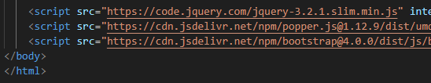
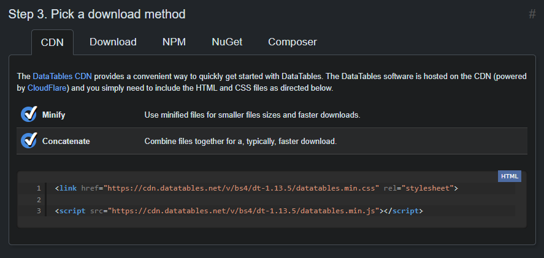
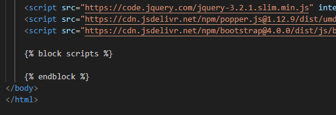
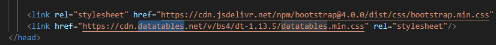

# jQuery

jQuery é uma biblioteca JavaScript rápida, pequena e rica em recursos. Ela torna coisas como manipulação de documentos HTML, manipulação de eventos, animação e Ajax muito mais simples com uma API fácil de usar que funciona em vários navegadores.

A importação do jQuery é bem simples, basta acessar o site (https://jquery.com/), baixar o arquivo e importar na página HTML onde ele será usado. Contudo, nós já importamos o jQuery junto com o BootStrap, pois o próprio BootStrap utiliza o jQuery para algumas de suas funcionalidades. Sendo assim, podemos pular esta etapa.

## Utilizando o jQuery

Antes de usarmos o jQuery, precisamos fazer um pequeno ajuste no nosso projeto. O uso do jQuery deve ser após a sua importação e, como o importamos no final do arquivo `modelo.html`, precisamos utilizá-lo após isso.  

  

Em ordem, importamos jQuery, Popper e BootStrap.

Se vamos utilizar o jQuery em outras páginas que usam o `modelo.html` como base, como podemos informar ao Django que seu uso deve ser após a sua importação, mas ainda dentro do `body`? Para isso, vamos criar mais um bloco após as importações que usaremos especificamente para estes casos.  

  

Perceba que o bloco está vazio, ou seja, na prática isso não irá adicionar nada a nenhum dos nossos templates. Contudo, ao utilizar este bloco em outra página, eu posso especificar e garantir que o conteúdo do bloco será executado após a importação dos javascripts.

Com esse ajuste, vamos abrir o arquivo `cadastros/templates/form.html` para realizar um pequeno teste. No fim do arquivo, vamos adicionar:

```django
  
<script>  
    $(document).ready(function(){  
        alert("Importação ok!");  
    });  
</script>  

```

Um script jQuery tem como padrão `$(seletor).ação();`. Esse seletor pode ser um ID, uma Classe, ou a própria página (`Document`). Nesse exemplo, o que o jQuery vai fazer é exibir uma mensagem de alerta quando a página estiver pronta, ou seja, quando ela for completamente gerada pelo navegador e os javascripts forem importados.  

## jQuery Masks

Além do jQuery "puro", também há diversos plugins disponíveis que utilizam o jQuery como base. Um deles é o jQuery Masks criado por Igor Escobar. É possível ver o plugin em ação ao acessar o seguinte link: https://igorescobar.github.io/jQuery-Mask-Plugin/

Para importar esse plugin, é necessário baixá-lo pelo mesmo link acima. Clique no botão __Download Now__ e baixe o arquivo. Ao baixar, descompacte e procure pela pasta **dist**. Daí, basta copiar o arquivo `jquery.mask.min` para a pasta `static/js` do projeto.

Vamos fazer mais um teste de exemplo. No mesmo template de antes, `cadastros/templates/form.html`, vamos editar o bloco `scripts` para:

```django
  
<script src=""></script>

<script>  
    $(document).ready(function(){  
        alert("Importação ok!");

        $("#id_descricao").mask("000.000.000-00")  
        // $("#id_descricao").mask("(00) 0000-0000")  
    });  
</script>  

```

Atente-se à importação do arquivo do jQuery Mask logo na primeira linha do bloco. Para não ser necessário criar mais um campo no nosso registro, eu irei utilizar o campo descrição como exemplo. Quando o Django cria uma caixa para cada campo especificado na view, ele dá uma ID para esse campo seguindo o seguinte padrão: `#id_nomedocampo`. Como o nome do campo é `descricao`, eu sei qual o id definido pelo Django.

Acima tem dois exemplos de máscaras, o primeiro seria utilizado para CPF e o segundo para um telefone. Esses e muitos outros podem ser vistos no mesmo site onde baixamos o jQuery Mask (https://igorescobar.github.io/jQuery-Mask-Plugin/). Vale salientar que essa máscara é apenas visual. Ao editar um CPF, digamos, o usuário pode ver:  

```
111.222.333-44  
```

Mas ao salvar no banco de dados, a informação será:  

```
11122233344  
```

De forma que utilizar uma máscara não irá interferir com os dados adquiridos. Além disso, nesses exemplos o plugin irá aceitar apenas números, então no caso que o usuário tente digitar algum texto ou símbolo inválido, o plugin irá ignorar, sendo uma verificação extra para o campo em questão.

**Extra:** Para utilizar o comando static do Django, primeiro é necessário usar o `load static` no início do arquivo. Como realizamos esse teste no `form.html`, onde já tem o `load static`, o exemplo funcionará perfeitamente. Mas caso você resolva usar em outro template, verifique e adicione a seguinte linha no início do arquivo, se necessário:  

```django
  
```

## DataTable

DataTable é mais um plugin que utiliza o jQuery como base. Também é possível testar suas funcionalidade online, acessando o seguinte link: https://datatables.net/

Assim como no plugin das máscaras, vamos precisar importar o DataTable antes de utilizá-lo. No site acima, clique em Download e na página seguinte, na seção '*Step 1. Choose a styling framework*', selecione BootStrap 4 (que é a versão que importamos no projeto). Após selecionar o estilo, vá até o fim da página para ter acesso aos links de importação:  

  

Assim como fizemos lá no início do projeto, quando importamos o BootStrap, vamos importar o DataTable. O primeiro link será adicionado ao nosso template `modelo.html`, no bloco `head` e após a importação do BootStrap.  

  

O segundo link será adicionado no bloco `body`, após a importação do jQuery e BootStrap. Só que, ao invés de adicionarmos no arquivo `modelo.html`, vamos adicionar apenas nos templates que utilizarem o DataTable. Como teste, vamos abrir o arquivo `cadastros/templates/listas/turma.html` e formatar a tabela das turmas como DataTable.

Para essa formatação, precisamos realizar três simples passos:  
Primeiro nós vamos dar um id para a nossa tabela, algo como `tabela-listar`.  

```django
<table class="table table-striped" *id="tabela-listar"**>*  
```

Depois nós vamos colocar todo o cabeçalho da tabela dentro de `thead` e todo o corpo da tabela dentro de `tbody`.  

```django
<table class="table table-striped" id="tabela-listar">  
    <thead>
        <tr>  
        …  
        </tr>  
    </thead>

    <tbody>
          
        …  
          
    </tbody>
</table>
```

Por fim, vamos adicionar o script no fim do arquivo:

```django
  
<script src="https://cdn.datatables.net/v/bs4/dt-1.13.5/datatables.min.js"></script>

<script>  
    $(document).ready(function(){  
        $("#tabela-listar").DataTable();  
    });  
</script>  

```

Novamente, atente-se à primeira linha do bloco, onde importamos a DataTable. Já dentro do script, a única coisa que fazemos é informar o id da tabela que será formatada como DataTable e está feito.  

**Extra:** Caso queira, é possível baixar o javascript, salvá-lo na pasta static/js e importá-lo ao invés de utilizar o link.

**Atenção:** Por padrão, a DataTable terá algumas informações em inglês, mas é possível alterar o idioma para português ou qualquer outro. Para isso, vamos adicionar como parâmetro à função DataTable:

```js
$("#tabela-listar").DataTable({  
    responsive: true,  
    // "bSort": false,  
    "aaSorting": [],  
    "pageLength": 10,  
    "language": {  
        "decimal": "",  
        "emptyTable": "Sem dados disponíveis",  
        "info": "Mostrando de _START_ até _END_ de _TOTAL_ registos",  
        "infoEmpty": "Mostrando de 0 até 0 de 0 registos",  
        "infoFiltered": "(filtrado de _MAX_ registos no total)",  
        "infoPostFix": "",  
        "thousands": ",",  
        "lengthMenu": "Mostrar _MENU_ registos",  
        "loadingRecords": "A carregar dados...",  
        "processing": "A processar...",  
        "search": "Procurar:",  
        "zeroRecords": "Não foram encontrados resultados",  
        "paginate": {  
            "first": "Primeiro",  
            "last": "Último",  
            "next": "Seguinte",  
            "previous": "Anterior"  
        },  
        "aria": {  
            "sortAscending": ": ordem crescente",  
            "sortDescending": ": ordem decrescente"  
        }  
    }  
});
```

Basicamente, o que fazemos é definir uma tradução para cada termo da tabela. Ex.: *previous* será substituído por *anterior.* Assim, mantemos o nosso site acessível para qualquer falante de português.

## Paginação

A DataTable consegue dividir os nossos dados em páginas e mostrar um conjunto de informações por vez, mas a página web irá baixar todos os registros de uma vez do banco de dados. Caso a quantidade de registros seja de centenas ou milhares, isso pode levar um tempo muito alto, o que não é o ideal. Portanto, pode ser necessário fazermos a paginação através do Django, de forma que apenas uma parcela dos registros seja transferida do banco de dados para a página web por vez.

Como exemplo, vamos acessar o arquivo `cadastros/views.py` e adicionar na classe *TurmaList*:

```py
class TurmaList(...  
    …  
    template_name = 'listas/turma.html'  
    paginate_by = 10
```

O número informado (10 no exemplo) é o número de registros que terá por página. Por incrível que pareça, a paginação já funciona. Podemos acessar o link da listagem de turmas e veremos apenas 10, caso haja mais do que isso. Para acessar as páginas seguintes, nós podemos digitar na barra de navegação:

http://127.0.0.1:8000/listar/turma/?page=1  

http://127.0.0.1:8000/listar/turma/?page=2  

http://127.0.0.1:8000/listar/turma/?page=3  

No entanto, apesar de já estar funcional, não queremos que os nossos usuários tenham que digitar manualmente o link de cada página, então iremos adicionar os links para eles. No template `cadastros/templates/listas/turma.html` vamos adicionar após a tabela:

```django
…  
</table>

<div class="text-center">  
      
    <a href="?page={{page_obj.previous_page_number}}">Anterior</a>  
    

    <span>Página: {{page_obj.number}}</span>

      
    <a href="?page={{page_obj.next_page_number}}">Próxima</a>  
      
</div>  
…
```

Agora nós informamos a página em que o usuário está atualmente (em `span`) e mostramos um link para a página anterior e outro para a página seguinte, caso haja.  

**Extra:** Também é possível adicionar links para a primeira e última página com:  

```django
<a href="?page=1">Primeira</a>  
…  
<a href="?page={{page_obj.paginator.num_pages}}">Última</a>
```
