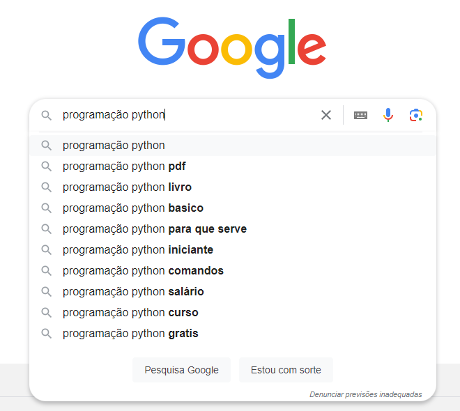
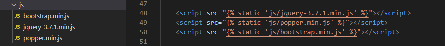

# Ajax - Primeiro GET

Ajax significa *Asynchronous JavaScript and XML*, ou *JavaScript e XML Assíncronos.* Ele permite que aplicações trabalhem de modo assíncrono, processando qualquer requisição ao servidor em segundo plano, enviando e recebendo dados do servidor sem precisar recarregar a página inteira.

Um exemplo bem conhecido do Ajax é a ferramenta de sugestões de pesquisa do Google, onde conforme você digita um termo de busca, sugestões são dadas enquanto que o restante da página permanece estática. Sem o Ajax, a cada letra digitada a página teria que ser inteiramente carregada, o que tornaria essa ferramenta nada prática.  

## Importação

O Ajax usa como base o jQuery e, portanto, precisamos importá-lo primeiro.

**Importante:** Nós importamos o jQuery no mesmo momento em que importamos o BootStrap, usando os links que o próprio BootStrap nos fornece. Contudo, a versão do jQuery que importamos foi a **Slim**, uma versão mais simples e, portanto, com menos opções. Uma das ferramentas que a versão Slim não possui é o Ajax. Por isso, precisamos atualizar a versão do jQuery que temos em nosso projeto.

A versão min do jQuery (**não** confundir *min* com *slim*: min é o arquivo comprimido, sem espaços; slim é uma versão mais simples, sem o ajax.) pode ser baixada pelo link abaixo:  
*https://code.jquery.com/jquery-3.7.1.min.js*

Daí basta salvar o arquivo na pasta *static/js* e importar essa versão no arquivo *modelo.html*.  

Lembrando que a ordem é jQuery, Popper e BootStrap por último. Com essa atualização feita, podemos começar a utilizar o Ajax.  

## Get Form

No Google Sala de Aula tem um projeto (Eventos) para usarmos como base no nosso estudo do Ajax. Ele possui um registro chamado Evento que possui dois campos: Descrição e Data. O CRUD foi implementado da forma que vimos anteriormente, utilizando o Django como facilitador e cada operação sendo realizada em uma página distinta, com a listagem sendo realizada no arquivo *listas/evento.html*. Baixe o projeto e dê uma olhada no código e no cliente para se familiarizar antes de começarmos.

Vamos exercitar o uso do Ajax recriando o CRUD completo, mas desta vez sem a necessidade de recarregar a página nenhuma vez. Começando pelo Create, vamos precisar mostrar ao usuário o formulário com os campos do registro a ser cadastrado. E, para separar essa informação do restante da página, vamos utilizar um **modal**.

Um modal é como se fosse uma janela, menor do que a janela principal, e que pode ser ativada e desativada à vontade. Um exemplo bem simples pode ser visto em:  
*https://www.w3schools.com/w3css/tryit.asp?filename=tryw3css\_modal*  

No nosso projeto, vamos adicionar o modal no arquivo *listas/evento.html*. Para diferenciar o botão que irá ativar o modal do botão 'Criar Evento', vamos adicionar o código seguinte após a tabela.

*\
*  
*…*  
*\</div\>*

*\<button type="button" class="btn btn-primary js-create"\>Novo Evento\</button\>*  
*\
*  
*\
*  
*\
*  
	  
*\</div\>*  
*\</div\>*  
*\</div\>*

Essas três divs aninhadas definem o modal usando o BootStrap, a única coisa que adicionamos ao padrão foi o id na primeira div (modal-evento). Lembrando que o nome do registro desse projeto é Evento. Na linha anterior as divs nós temos um botão que será usado para o Create. Ao clicarmos nele, o modal será ativado e, simultaneamente, iremos buscar no servidor o formulário que será mostrado nessa janela. Para isso, vamos precisar de uma função JavaScript e, devido a isso, já definimos ali em classe qual será o nome dessa função (js-create).

A seguir, precisamos definir o formulário, já que não iremos mais utilizar as views padrões do Django. No módulo *paginas*, vamos criar o arquivo *forms.py* e nele colocar:

*from django import forms*  
*from .models import Evento*

*class EventoForm(forms.ModelForm):*  
*class Meta:*  
*model \= Evento*  
*fields \= ('descricao', 'data')*

Aqui nós importamos o registro Evento do arquivo models e definimos o formulário (EventoForm) informando o model (Evento) e os campos que irão ser mostrados (descrição e data). Agora vamos para o arquivo *views.py*, onde vamos fazer a conexão do formulário com o template. Antes de criarmos uma nova função, vamos adicionar às importações:

	*from django.http import JsonResponse*  
*from django.template.loader import render\_to\_string*  
*from .forms import EventoForm*

A primeira importação é o *Json*, ou *JavaScript Object Notation*. Ele será usado para lidar com a troca de mensagens entre servidor e cliente. A segunda importação, *render\_to\_string*, vai servir para "converter" a página em um texto, o qual será enviado para o cliente. Lá, o navegador vai substituir/atualizar essa informação na página, sem atualizar ela por completo. E a última importação é o formulário que criamos anteriormente. Após as importações, vamos criar uma nova função:

	*def evento\_create(request):*  
		*form \= EventoForm()*  
		*context \= {'form': form}*  
*html\_form \= render\_to\_string('listas/parcial\_create.html', context, request \= request)*  
		*return JsonResponse({'html\_form': html\_form})*

Essa função vai servir para renderizar o template *parcial\_create.html* (que ainda vamos criar), transformar em um texto (string) e enviar para o cliente, tudo isso usando o formulário *EventoForm* como base. Agora, vamos adicionar essa função no arquivo *urls.py*. Primeiro, vamos importar a função com:  
	*from .views import evento\_create*

e a seguir vamos adicionar ao urlpatterns:  
	path('js/criar', evento\_create, name='js-criar'),

Agora restam apenas mais duas etapas para completarmos a primeira parte desse projeto: A primeira é criar o template *parcial\_create.html*; e a segunda é criar o arquivo javascript, onde iremos configurar o ajax propriamente dito. Vamos começar pelo template. Na pasta templates/listas, vamos criar um novo arquivo com o nome *parcial\_create.html*. Nele, vamos construir um simples formulário:

	*\<form method="post"\>*  
		**

		*\
*  
			*\<h4 class="modal-title"\>Criar um novo evento\</h4\>*  
			*\<button type="button" class="close" data-dismiss="modal"\>X\</button\>*  
		*\</div\>*

		*\
*  
			*{{ form.as\_p }}*  
		*\</div\>*

		*\
*  
			*\<button type="submit" class="btn btn-primary"\>Criar\</button\>*  
		*\</div\>*  
	*\</form\>*

Começamos com o uso do *csrf\_token*, lembrando que isso é um token usado pelo django para evitar alguns ataques de roubo de credenciais. A primeira *div* dentro do *form* é o cabeçalho com apenas um título e um botão para fechar a janela modal. A segunda *div* é o formulário em si, onde usamos o django para formatar os campos para nós. E a última div é o botão para enviar o formulário. Essa é a única parte do site que será atualizada no site após a requisição ajax. Vamos agora para o javascript. Na pasta *static/js*, vamos criar um arquivo chamado *evento.js*. É nele que vamos configurar todas as operações ajax que faremos nesse projeto. Vamos começar com:

	*$(function(){*  
		*$(".js-create").click(function(){*  
			*$.ajax({*  
				*// Corpo da função*  
*});*  
*});*  
*});*

O que definimos até agora é que, quando o elemento com a classe 'js-create' (que é o botão que adicionamos logo após a tabela) receber um clique, ele vai chamar o ajax e realizar o que estiver no *'Corpo da função'*, o qual vai ser:

	*// Corpo da função*  
	*url: 'js/criar',*  
	*type: 'get',*  
	*dataType: 'json',*  
	*beforeSend: function(){*  
		*$("\#modal-evento").modal("show");*  
	*},*  
	*success: function(data){*  
		*$("\#modal-evento .modal-content").html(data.html\_form);*  
	*}*

Começamos definindo alguns parâmetros como *url, type e dataType*. Esse *get* vai servir para pegarmos os dados do formulário do servidor. A função *beforeSend* serve para realizar algo antes de enviar a requisição, que no nosso caso será abrir (*show*) a janela modal. Já a função *success* vai ser o que faremos ao receber a resposta do servidor, que nesse caso será atualizar o conteúdo do elemento *'modal-content'* dentro do elemento *'modal-evento'* pela resposta recebida. Agora, basta importar esse javascript no nosso html. Vamos primeiro em *modelo.html* e, no fim do arquivo, vamos verificar se, **após** a importação do jquery, poppy e bootstrap, tem o seguinte bloco. Vamos adicionar caso não tenha.

	**  
		  
	**

Agora vamos no evento.html e vamos adicionar ao fim do arquivo:

	**  
	*\<script src=""\>\</script\>*  
	**

Com isso, nós terminamos essa primeira parte do ajax e já podemos testar a nossa página. Ao abri-la e clicar no botão que criamos no início, devemos ver a janela modal surgindo no centro da tela e tendo como conteúdo o que definimos no arquivo *parcial\_create.html*.
