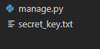
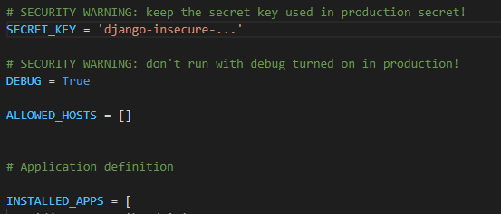

**Hospedagem**

Hospedagem é um processo muito importante no processo de criar um sistema para internet, já que sem a hospedagem, basicamente ninguém será capaz de utilizar o seu sistema. Normalmente, é necessário pagar algum servidor para ser apto a hospedar um site em seu domínio. O endereço escolhido (Ex.: google.com ou wikipedia.com) também costuma ser um custo extra na hospedagem de um sistema. Esse custo pode ser do programador, da empresa na qual ele trabalha ou até mesmo do próprio cliente, a depender do contexto da situação

No entanto, existem alguns servidores gratuitos pela internet, um deles sendo o que iremos utilizar para teste, [Python Anywhere](https://www.pythonanywhere.com/). Esses servidores, por serem um serviço gratuito, costumam ser limitados de diversas formas e lentos. Ainda assim, são de extrema importância para um primeiro teste do nosso projeto. Seja um teste interno entre o grupo responsável por criar o sistema, um teste feito com o cliente para que este veja o progresso atual ou até mesmo um teste aberto para qualquer usuário para se ter um feedback sobre como prosseguir. Além de também ser útil para descobrir, e posteriormente corrigir, bugs.

Em relação ao Python Anywhere, ele permite que você hospede uma página web sem custo algum. Como limitação, há o limite de uso de CPU de 100s por dia e um máximo de armazenamento de 512 MB. Além disso, é necessário acessar o servidor ao menos uma vez a cada três meses, para que o site não seja retirado do ar. Já em relação ao endereço, não é possível escolher um nome, sendo este o mesmo do seu usuário. Ex.:  
	user.pythonanywhere.com

**Importante:** Leve essa informação acima em conta quando for definir o seu nome de usuário, já que colegas, professores e até mesmo clientes irão precisar usá-lo para acessar o seu site.

Vamos começar criando uma conta no site. Acesse o site e, no canto superior direito, clique em *Pricing & signup* ou acesse esse [link](https://www.pythonanywhere.com/pricing/). O Python Anywhere também possui alguns planos pagos, oferecendo uma melhor qualidade de serviço em troca. Contudo, vamos começar com o plano *Beginner*, que é 100% Free. Na faixa amarela, clique em *Create a Beginner account*. Preencha com o seu nome de usuário, email e senha. **Lembre-se que o seu nome de usuário será o mesmo utilizado no link de sua página\!**

Ao logar, vamos nos deparar com o *DashBoard*, que seria como um painel principal. Dentre várias opções, as mais importantes no momento serão: *Consoles*, onde poderemos abrir um terminal para executar comandos; *Files*, onde iremos carregar os nossos arquivos; e *Web apps*, que é onde faremos algumas configurações do nosso sistema. Além disso, também é possível ver o uso atual da CPU e do armazenamento, assim como o máximo de cada um.

Antes de começarmos a interagir com o servidor, vamos preparar o nosso projeto para o *upload*. O primeiro passo vai ser criar na pasta do projeto um arquivo chamado secret\_key.txt. Ele vai ficar na mesma pasta que o manage.py.  

Caso você abra o arquivo settings.py, você verá que há uma chave SECRET\_KEY com um valor sendo uma sequência aleatória de letras, números e símbolos. Essa chave é usada para verificações de segurança entre comunicações com o seu site, buscando evitar roubo de dados como login e senha do usuário, por exemplo. O django provê uma chave de exemplo inicial para testes, mas ao hospedar um site, queremos usar uma chave mais segura e única para o nosso site. Para gerar um chave como essa, podemos executar no terminal do próprio VS o seguinte código:

	python \-c "from django.core.management.utils import get\_random\_secret\_key; print(get\_random\_secret\_key())"

Esse código irá retornar, no próprio terminal, uma nova chave que poderemos usar como *secret\_key* do nosso site. Contudo, ao invés de modificarmos diretamente o arquivo settings.py, vamos adicionar essa chave no arquivo secret\_key.txt que criamos anteriormente e depois faremos essa importação no settings.py, mas isso apenas após hospedarmos o site.

A seguir vamos criar mais um arquivo, desta vez **fora** da pasta do projeto. Ele será requirements.txt e irá conter todas as importações necessárias para o funcionamento do nosso projeto. Tendo como base o projeto que vimos em aula, o arquivo requirements.txt iria conter:

django  
django-crispy-forms  
crispy-bootstrap4  
django-braces  
django-cleanup

Esse arquivo não é de fato necessário, mas iremos precisar instalar todas essas importações no servidor e será mais simples ao utilizar um arquivo dessa forma. Agora, iremos selecionar a pasta do nosso projeto e o arquivo requirements.txt e iremos zipar tudo num único arquivo (Ex.: projeto.zip).

Vamos retornar ao Python Anywhere e, no DashBoard, vamos clicar em *Files*. Na página que irá abrir, vamos clicar em *Upload a file* e vamos escolher o arquivo zipado (Ex.: projeto.zip) que irá conter o nosso projeto e o txt com os requisitos.

Agora precisamos *"deszipar"* esse arquivo e iremos fazer isso pelo terminal. Para isso, vamos clicar em *Open Bash console here*, essa opção fica na parte superior da tela, logo abaixo de DashBoard. No console, vamos digitar:  
	*unzip arquivo.zip*

Vamos esperar esse processo ser concluído e, ainda no console, vamos digitar:  
	*mkvirtualenv projeto-env*

Com *projeto-env* sendo qualquer nome que você queira dar a essa máquina virtual. Usar uma máquina virtual é um passo recomendado ao se utilizar o django e também será útil no caso de você desejar hospedar um outro site com diferentes requisitos, sendo necessário apenas deletar e criar uma nova máquina virtual, sem a necessidade de resetar o servidor como um todo. Após o ambiente virtual ser criado (isso pode levar alguns minutos), vamos digitar:  
	*pip install \-r requirements.txt*

Esse comando irá instalar todas as importações que colocamos no arquivo txt. Assim, podemos deixar o console executando cada uma das instalações de forma automática enquanto concluímos o restante da configuração.  
**Extra:** Caso seja necessário, use *workon projeto-env* para trabalhar dentro do ambiente virtual e *deactivate* para sair do ambiente.  
**Extra 2:** Ao voltar ao DashBoard, você verá que há um link para o console na área Consoles, mesmo se você tiver fechado a janela. Isso porque o console permanece aberto no servidor a não ser que você use o comando *exit*. Só é permitido ter no máximo três consoles abertos por vez.

Voltando ao DashBoard, vamos clicar em *Web Apps* para criar o endereço do nosso site. Vamos criar um *new web app* e, quando solicitado, vamos escolher a opção *Manual Configuration*. **Não** escolher a opção Django. Essa opção é para o caso de quem vai começar um projeto Django do zero e editar pelo próprio servidor (basicamente o que fizemos desde o início). Após o app ser criado, vamos preencher alguns campos:  
**Atenção:** Troque os nomes abaixo pelos nomes do seu projeto. User é o nome de usuário. Projeto é o nome da pasta do seu projeto. É possível conferir indo em DashBoard \> Files e vendo no lado esquerdo o nome da pasta.  
	Em Code, Source Code:  
		*/home/user/projeto*  
	Em Code, Working directory:  
		*/home/user/*  
	Em Virtualenv:  
		*/home/user/.virtualenvs/projeto-env*  
	Em Static files, URL:  
		*/static/*  
	Em Static files, Directory:  
*/home/user/projeto/static*

A parte de configuração nesta página está pronta, agora vamos editar o arquivo wsgi.py. Vamos procurar novamente por *Code* e vamos clicar no link para o arquivo wsgi. O link deve ser algo como:  
	/var/www/user\_pythonanywhere\_com\_wsgi.py

Esse arquivo wsgi é diferente do que temos no nosso projeto django. O servidor irá utilizar este e irá ignorar o padrão do projeto. Ao clicar, vamos apagar o que tiver e colar o seguinte modelo:

*\# \+++++++++++ DJANGO \+++++++++++*  
*\# To use your own Django app use code like this:*  
*import os*  
*import sys*

*\# assuming your Django settings file is at '/home/user/projeto/projeto/settings.py'*  
*path \= '/home/user/projeto'*  
*if path not in sys.path:*  
*sys.path.insert(0, path)*

*os.environ\['DJANGO\_SETTINGS\_MODULE'\] \= 'projeto.settings'*

*\#\# Uncomment the lines below depending on your Django version*  
*\#\#\#\#\#\# then, for Django \>=1.5:*  
*from django.core.wsgi import get\_wsgi\_application*  
*application \= get\_wsgi\_application()*  
*\#\#\#\#\#\# or, for older Django \<=1.4*  
*\#import django.core.handlers.wsgi*  
*\#application \= django.core.handlers.wsgi.WSGIHandler()*

Novamente, lembre-se de substituir os nomes *user* e *projeto* pelos mesmos nomes do seu usuário e pasta do projeto. Essa parte final é dividida em dois blocos. O primeiro é para o caso da versão do Django ser 1.5 ou superior (que é o nosso caso) e o segundo bloco (comentado) é para o caso de ser uma versão mais antiga do que a 1.5. Acredito que será improvável utilizar uma versão mais antiga, mas caso seja necessário, basta comentar o primeiro bloco e descomentar o segundo.

Agora vamos voltar no DashBoard e vamos clicar em Files. Vamos navegar até o nosso arquivo settings.py. Algo como:  
	*/home/user/projeto/projeto*

Na aba à direita vai ter os arquivos que esta pasta contém. Vamos clicar no arquivo settings.py e ele será aberto para edição. Vamos procurar, próximo do início, pela chave SECRET\_KEY. Nós vamos alterar esta chave e as duas seguintes (DEBUG e ALLOWED\_HOSTS), além de adicionar algumas flags após elas. De IA em diante permanece tudo igual. Então vamos trocar algo como:

por:

*\# SECRET\_KEY \= 'django-insecure-\_...'*  
*with open('/home/user/projeto/secret\_key.txt') as f:*  
*SECRET\_KEY \= f.read().strip()*

*\# SECURITY WARNING: don't run with debug turned on in production\!*  
*DEBUG \= False*

*ALLOWED\_HOSTS \= \['user.pythonanywhere.com'\]*

*SECURE\_SSL\_REDIRECT \= True*  
*SESSION\_COOKIE\_SECURE \= True*  
*CSRF\_COOKIE\_SECURE \= True*  
*SECURE\_HSTS\_INCLUDE\_SUBDOMAINS \= True*  
*SECURE\_HSTS\_PRELOAD \= True*  
*SECURE\_HSTS\_SECONDS \= 3600 \# 3600 segundos, uma hora*

Mais uma vez, **atenção** para os *user* e *projeto*. Troque-os pelos nomes corretos. É aqui onde vamos importar a chave naquele arquivo secret\_key.txt ao invés de usar o padrão do Django. O DEBUG False vai trocar as páginas de erro que costumamos ver durante a implementação do sistema por páginas padrão do servidor, de forma que o usuário não consiga ver dados do sistema como páginas disponíveis ou trechos do código. O ALLOWED\_HOSTS vai permitir comunicações entre páginas desse domínio. No caso de você usar imagens hospedadas em outro servidor, é aqui onde essa permissão será adicionada. Ex.:  
	*ALLOWED\_HOSTS \= \['user.pythonanywhere.com', 'server.imgserver.com'\]*

As seis flags que vem depois são referentes à segurança do site e podem causar alguns conflitos durante a implementação e testes do sistema, e é por isso que vamos adicionar apenas no servidor e não no arquivo que temos no computador e usamos para testes.

**Flags:**  
*SECURE\_SSL\_REDIRECT* redireciona requisições http para https. Ou seja, se alguém tentar acessar o seu site com o link:  
	***http**://user.pythonanywhere.com/*  
Ele será automaticamente redirecionado para:  
	***https**://user.pythonanywhere.com/*

*SESSION\_COOKIE\_SECURE* informa que os cookies (dados que mantém o usuário logado ao site) devem ser encriptados antes de serem enviados.

*CSRF\_COOKIE\_SECURE* é similar ao anterior, mas referente ao CSRF, aquele token que o Django usa nos formulário para evitar alguns ataques cibernéticos.

As três flags seguintes são referentes à mesma coisa e funcionam em conjunto. Caso um domínio não seguro (*http://…*) tente acessar o seu site, o acesso desse domínio ao seu site será bloqueado por um determinado tempo. No exemplo acima, seria por uma hora, para evitar um bloqueio muito longo em caso de algum erro ou devido a algum teste. Mas o valor padrão para essa flag é de um ano (31.536.000 segundos).

Por fim, vamos salvar a edição do arquivo settings.py e vamos retornar para o DashBoard. Vamos abrir o console e ver se as instalações já foram concluídas. Vamos esperar, se necessário e, após tudo ter sido devidamente instalado, vamos retornar ao DashBoard e clicar em Web Apps. Vamos clicar no botão Reload e, após um momento, clicar no link acima para testarmos o nosso sistema no ar e disponível para qualquer pessoa do globo\!
