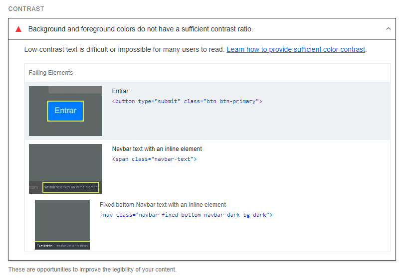
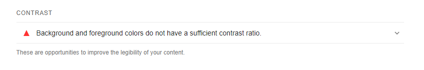
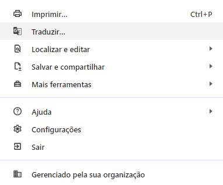
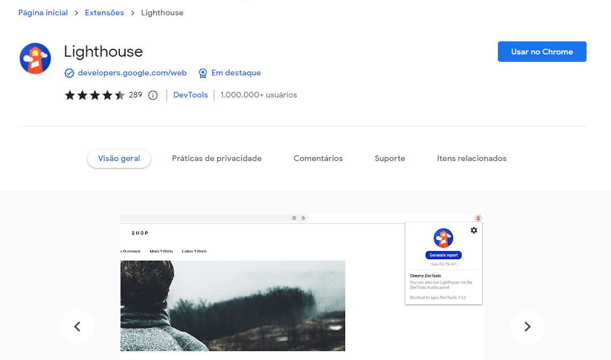
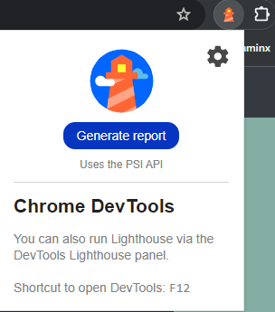
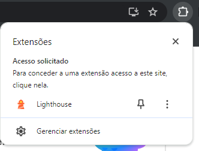
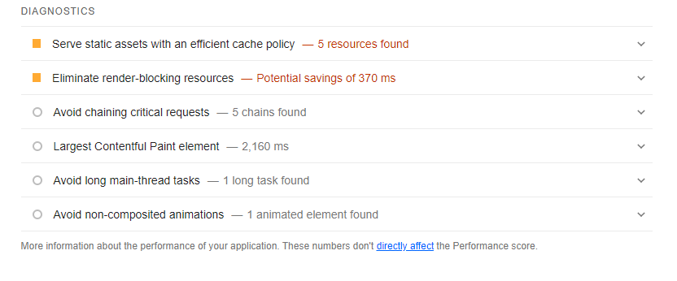
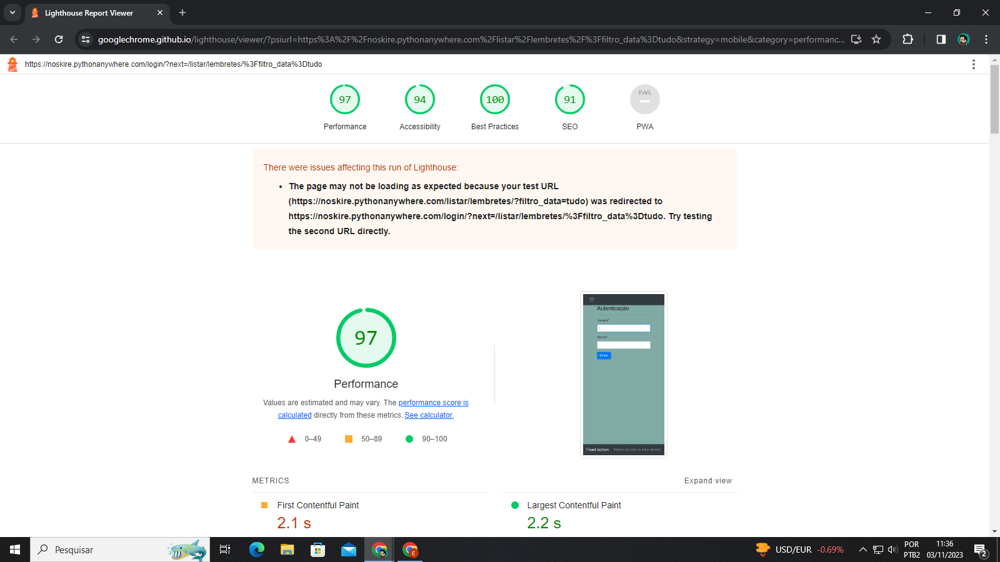

# Google Lighthouse

É uma ferramenta que tem por objetivo testar e devolver aos desenvolvedores recomendações para melhorias como, por exemplo, o desempenho, o SEO (otimização para motores de busca), a segurança, as práticas recomendadas e a acessibilidade de um site\! É uma forma de se ter feedback do site, sem a necessidade de um usuário ou testes manuais.

Para usar essa ferramenta, primeiro é necessário instalar a extensão no G. Chrome. Para isso, basta buscar por 'Google Lighthouse' ou acessar o link abaixo:  
https://chrome.google.com/webstore/detail/lighthouse/blipmdconlkpinefehnmjammfjpmpbjk?hl=pt-BR

Clique em 'Usar no Chrome' e em 'Adicionar Extensão' quando surgir o alerta.  

Após a instalação, você pode acessar qualquer site e clicar no símbolo que aparece ao lado da barra do endereço, apertando em seguida no 'Lighthouse' mais embaixo.  

Uma nova janela vai aparecer. Basta clicar no botão azul, 'Generate report', e esperar pelo resultado. **(Pode levar alguns minutos)**  

Por fim você terá acesso a uma página como essa. Na parte superior é possível ver a nota de cada parâmetro. Mais abaixo, para cada parâmetro, você verá pontos que podem ser melhorados.

****

  

Além disso, ao clicar em um dos erros/sugestões, será mostrado formas de corrigir o problema, além de um link com mais informações sobre o problema e possível correção.  

Essa é uma forma simples e prática de ter um feedback e corrigir possíveis erros do projeto, melhorando a qualidade geral do site, além de aprender mais sobre boas práticas no desenvolvimento de projetos para web.

PS: Caso não apareça a opção de traduzir a página, clique nos três pontos à direita da barra de endereço…  
  
E clique em 'Traduzir' na janela que aparecer.  

