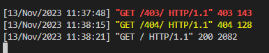
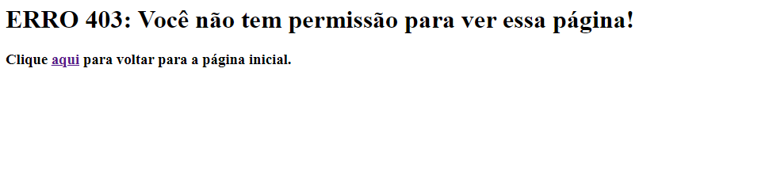
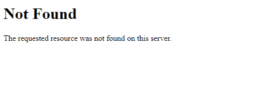
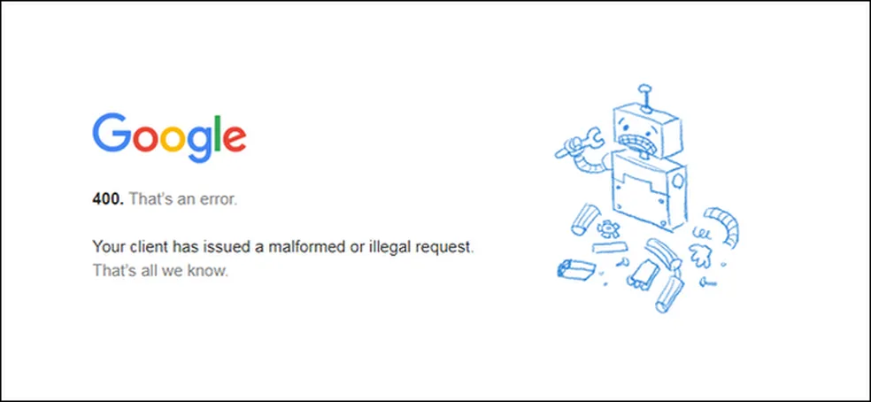
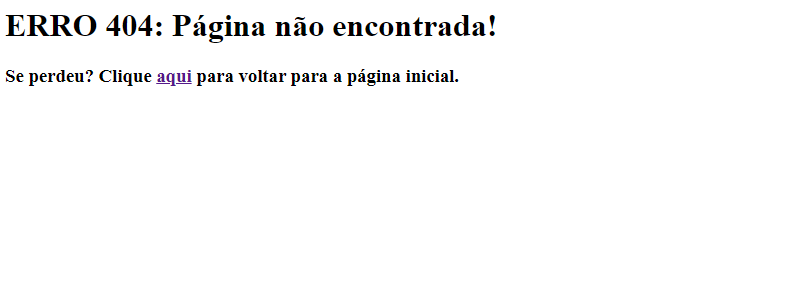
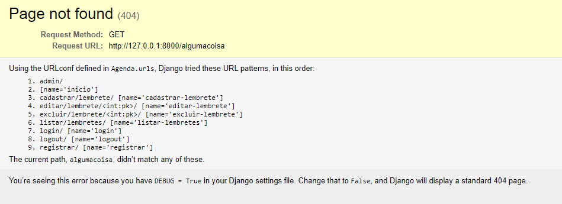

**Páginas de Erro**

Usualmente já existem páginas de erro pré-configuradas na criação de um projeto Web, seja utilizando o Django ou não. Essa páginas padrão costumam ser bem simples e informam apenas o número do erro e nada mais, como 404 (página não encontrada).

Por mais que seja possível manter essas páginas, em certos casos, criar as suas próprias páginas de erro traz algumas vantagens, como um design mais similar ao restante do site e até mesmo outras informações e/ou opções além do erro gerado, como retornar à página inicial. Alguns sites até mesmo utilizam essas páginas de erro como uma fonte de humor ou descontração. Isso traz ao projeto como um todo uma aparência mais profissional.

Veja as páginas de erro do Google e do Lego, por exemplo:  
  

O design da sua página de erro pode tanto usar texto e CSS, como imagens, sendo uma decisão a ser feita a depender do projeto em si. Mas independente da aparência da sua página, a configuração dela segue o mesmo padrão.

**Configurando uma página de Erro no Django**

Vamos começar com o erro mais comum, 404\. O erro 404 ocorre quando o usuário tenta acessar uma página que não existe. Você pode forçar esse erro facilmente ao tentar acessar um endereço que não foi cadastrado nas suas urls.  
		*link/algumacoisa*  

A maioria das linguagens de programação e frameworks tem como base o inglês e o mesmo ocorre para essas páginas de erro padrão. Então, só em criar uma versão dela em português já seria uma melhora interessante para os usuários brasileiros.

**Extra:** Para essas janelas padrões de erro aparecer, o seu projeto deve estar em modo produção (DEBUG \= False), já que em modo debug a janela de erro mostrada será a seguinte:  
  
Caso o seu projeto já não esteja em produção, abra o arquivo settings.py e procure por DEGUB, edite as duas linhas seguintes para:  
	*DEBUG \= False*  
*ALLOWED\_HOSTS \= \["127.0.0.1"\]*

Vamos começar criando o template que iremos usar para a página de erro. Na pasta templates (pode ser dentro de qualquer módulo), vamos criar o arquivo *404.html*. Como teste, vamos escrever algo como:  
*\<h1\>ERRO 404: Página não encontrada\!\</h1\>*

*\<h3\>Se perdeu? Clique \<a href=""\>aqui\</a\> para voltar para a página inicial.\</h3\>*

Agora basta acessar alguma página inexistente para ver como erro:  

O mesmo funciona para qualquer outro código. Os códigos de erro mais comuns, são:  
404: Page Not Found (Página não encontrada)  
403: Forbidden (Quando o usuário não tem permissão para acessar aquela página)  
400: Bad Request (Erro abrangente do Cliente)  
500: Server Error (Erro abrangente do Servidor)

**Como forçar uma página de erro**

O erro 404 é um erro simples de forçar para teste, mas outros erros são mais complicados e causar erros de forma intencional no seu código para gerá-los pode não ser a melhor ideia. Pensando nisso, foram criadas formas de se forçar uma página de erro, e vamos ver como fazer isso agora, usando o erro 403 para isso.

Vamos começar criando o template do erro. Na mesma pasta que criamos o arquivo 404.html, vamos criar o arquivo 403.html e escrever:  
*\<h1\>ERRO 403: Você não tem permissão para ver essa página\!\</h1\>*

*\<h3\>Clique \<a href=""\>aqui\</a\> para voltar para a página inicial.\</h3\>*

Quase uma cópia da anterior, alterando principalmente o título. Agora resta forçar esse erro para testarmos no cliente. Para isso, vamos alterar os arquivos views.py e urls.py no mesmo módulo onde o arquivo 403.html se encontra.

Em views.py, vamos adicionar:  
*from django.core.exceptions import PermissionDenied*  
*from django.shortcuts import render*

*def permission\_denied(request):*  
    *raise PermissionDenied*

*def error\_403(request, exception):*  
    *return render('403.html')*

Em urls.py, vamos adicionar:  
	*from .views import permission\_denied*

*urlpatterns \= \[*  
    *path('', IndexView.as\_view(), name='inicio'), \# path antigo*  
    *path('403/', permission\_denied),*  
*\]*

*handler403 \= 'paginas.views.error\_403'*

Com isso, ao acessarmos o link:  
	*http://127.0.0.1:8000/403/*  
Vamos ter acesso à seguinte página de erro:  

Seria possível criar um um caminho simples, como o da página início, para testar a parte visual do template 403.html. O motivo de termos esse trabalho extra é para podermos gerar o erro de fato. Ao acessar o caminho 403, você poderá ver no terminal do VSCode a seguinte mensagem:  

O normal seria a última linha, código 200\. Ao tentar acessar qualquer caminho inexistente, o erro gerado é o 404 (linha amarela). Já ao tentar acessar o 403, recebemos, de fato, o erro 403\. Se tivéssemos apenas criado um path simples, como o da página inicial, o servidor retornaria código 200, OK.
