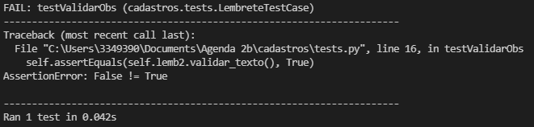
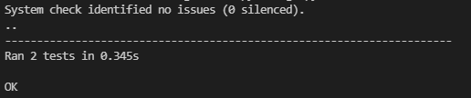
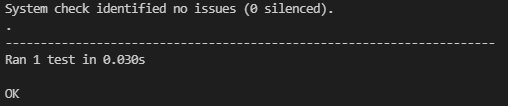
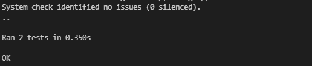
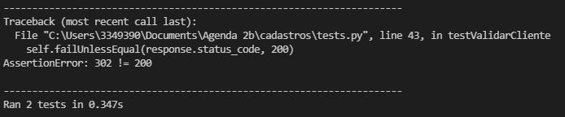

**Testes**

Ter feedback de usuários alpha/beta e/ou ter um programador (ou mais) com a tarefa de testar o projeto é algo ótimo para evitar erros e bugs durante a produção, ou seja, após disponibilizar o acesso ao projeto para o usuário comum. No entanto, nem sempre isso é possível, restando ao programador que está criando o projeto também ser o responsável pelos testes.

O procedimento de testar um projeto, ainda mais um projeto web que costuma ser extenso e possuir dezenas, senão centenas, de arquivos, é algo trabalhoso e que demanda muito tempo. Se o programador desejar testar o projeto com frequência, então, pior ainda.

Nesses casos, é possível automatizar alguns testes pelo django, utilizando os arquivos tests.py. Dessa forma, apesar do trabalho extra inicial, para se criar os testes, todos os demais testes são feitos de forma automática, consumindo não mais do que alguns segundos do programados.  
**Testando Funções**

**Atenção:** Para os exemplos a seguir, será usado o projeto Agenda postado no GSA:  
Em models.py, vamos adicionar ao fim do modelo Lembrete uma função simples para testarmos:  
*class…*  
    *def validar\_texto(self):*  
        *if self.obs:*  
            *return True*  
        *else:*  
            *return False*

Por questão de facilidade no aprendizado, vamos manter a função bem simples. Ela irá retornar True no caso do parâmetro obs (CharField) ter algum valor e False no caso do parâmetro obs estar vazio ("").

Ao criar um teste no seu projeto, você pode tanto usar funções simples como essa ou criar funções bem mais complexas, a depender do projeto e do que (e como) você deseja testar. O mais importante é o retorno da função, nesse caso, *True e False*. Esses valores não precisam ser, obrigatoriamente, booleanos, podendo ser int (0, 1, 2…), string ("Verdade", "Nome"...), etc. São esses valores que serão usados para verificar se a função está correta ou não.

Agora vamos abrir o arquivo tests.py e escrever:  
*import unittest*  
*from .models import Lembrete*  
*from django.contrib.auth.models import User*

*class LembreteTestCase(unittest.TestCase):*  
    *def setUp(self):*  
        *\# Pega um usuário, necessário para o cadastro*  
        *self.user \= User.objects.get(username="admin")*  
          
        *\# Cria lembretes*  
        *self.lemb1 \= Lembrete.objects.create(titulo="Lembrete 01", descricao="desc", obs="obs", relevancia=1, data="2023-12-03", usuario=self.user)*  
        *self.lemb2 \= Lembrete.objects.create(titulo="Lembrete 02", descricao="desc", obs="", relevancia=1, data="2023-12-06", usuario=self.user)*

    *def testValidarObs(self):*  
        *self.assertEquals(self.lemb1.validar\_texto(), True)*  
        *self.assertEquals(self.lemb2.validar\_texto(), False)*

    *def tearDown(self):*  
        *\# Apaga os registros criados*  
        *self.lemb1.delete()*  
        *self.lemb2.delete()*

Toda classe de teste tem duas funções de nome padrão (não obrigatórias) que são *setUp* e *tearDown*. Atente-se ao U e D maiúsculos separando as palavras (set-Up, tear-Down). A função setUp sempre será a primeira a ser chamada e serve para preparar o que for necessário para os testes seguintes. A função tearDown sempre será a última a ser chamada e serve para finalizar os testes, geralmente apagando o que foi criado durante os testes. O uso dessas funções não é obrigatório, você pode criar uma classe de teste sem a função setUp ou a tearDown.

Além delas, é possível criar quantas funções de teste você quiser dentro da classe. Nós começamos criando a *testValidarObs*, onde vamos chamar a função *validar\_texto()* para os dois registros criados em setUp e verificar seus valores. Usamos a função *assertEquals* para verificar se os valores são iguais. Em outras palavras, essa função teste vai executar a função *validar\_texto()* e irá verificar se o retorno dessa função é True (que é o valor que informamos à seguida). Se forem iguais, o teste será aprovado. Caso contrário, o teste irá dar erro e esse erro será informado para nós.

Como deixamos o Obs do segundo registro vazio (""), o retorno da função para esse registro será False, o que vai gerar um erro na segunda linha do teste. Para verificarmos se tudo está indo como o esperado, vamos digitar no terminal:  
	*py manage.py test*  
Esse comando irá rodar todos os testes encontrados em todos os arquivos tests.py do projeto e teremos como resultado:  

Na penúltima linhas nós podemos ver: *AssertionError: False \!= True*  
Isso informa que a função *lemb2.validar\_texto()* retornou *False* e que isso é diferente do que esperávamos, *True*. Esse erro já era esperado, mas qualquer erro, esperado ou não, terá uma saída similar, com a informação recebida da função, seguido da informação esperada dela.

Para corrigir, podemos:

1) adicionar algum valor para o parâmetro obs do segundo lembrete ou  
2) trocar o valor esperado para False.

Realizando uma das mudanças (**não** as duas), teremos como resposta:  
  
Um teste executado, tudo OK.

**Extra:** Não é necessário que o projeto esteja sendo executado com o *runserver* para o funcionamento dos testes.

**Extra 2:** O número de testes representa a quantidade de funções de testes criadas, sem contar com os setUp e tearDown. Nesse caso, apenas uma (testValidarObs).

**Simulando um Cliente (Navegador) \- GET**

Outra forma de realizar testes é simulando um acesso remoto ao servidor, seja tentando acessar páginas ou cadastrar novos registros. Para isso, primeiro precisamos criar um objeto *Client*, para poder simular esse acesso. No arquivo tests.py, vamos importar:  
*from django.test.client import Client*  
Agora, vamos adicionar na função setUp:  
        *\# Cria um cliente*  
        *self.client \= Client()*  
Ao invés de utilizar a mesma função de antes (testValidarObs), vamos criar uma nova logo após ela:  
    *def testValidarCliente(self):*  
        *\# Loga o usuário*  
        *self.client.login(username="admin", password="admin")*

        *\# Faz uma requisição GET*  
        *response \= self.client.get('/listar/lembretes/?filtro\_data=tudo')*

        *\# Verifica se a resposta foi 200 OK*  
        *self.failUnlessEqual(response.status\_code, 200\)*

        *\# Verifica se há 4 lembretes*  
        *self.failUnlessEqual(len(response.context\['object\_list'\]), 4\)*

        *\# Verifica se o template utilizado foi listas/lembrete.html*  
        *self.failUnlessEqual(response.template\_name\[0\], 'listas/lembrete.html')*  
E, por fim, em tearDown, vamos adicionar:  
*\# Desloga o cliente*  
        *self.client.logout()*

Em *testValidarCliente*, começamos logando o cliente, já que no projeto de exemplo é necessário estar logado para poder ver os registros no banco. Logo em seguida fizemos uma requisição GET para simular o acesso à uma página. Veja que aqui precisamos colocar o caminho completo (a partir do link base). Então se o link é:  
	*http://127.0.0.1:8000/listar/lembretes/?filtro\_data=tudo*  
O caminho a se colocar é:  
	*/listar/lembretes/?filtro\_data=tudo*  
É possível passar argumentos no caminho, como fizemos, ou não. Nesse caso, seria apenas:  
*/listar/lembretes/*  
Tenha cuidado extra com as barras /, pois uma a mais ou a menos vai resultar em um erro de acesso.

Recebemos a resposta do GET na variável *response* e fizemos três testes: Se o código foi 200 (OK); se o número de registros na lista *object\_list* é igual a 4 (já tinha dois registros cadastrados no projeto e dois outros foram cadastrados no setUp); e se o template utilizado para gerar a página foi o *listas/lembrete.html*.

Além desses testes, é possível realizar vários outros usando a resposta da requisição como base. Novamente, isso vai depender do seu projeto e do seu objetivo com o teste em questão. Por fim, deslogamos o usuário no fim da execução (tearDown). Vamos executar os testes para ver o resultado:  
*py manage.py test*  

Dois testes executados (testValidarObs e testValidarCliente), resultado OK.

**Simulando um Cliente (Navegador) \- POST**

Vamos realizar uma simulação de um POST, cadastrando um novo registro ao sistema. Ainda na função testValidarCliente, vamos adicionar ao fim:  
        *\# Faz uma requisição POST*  
        *\# O usuário será pego automaticamente do cliente (admin) devido ao views*  
        *response \= self.client.post('/cadastrar/lembrete/', {"titulo": "Trabalho", "relevancia": 1, "data": "2023-12-08"})*

        *\# Verifica se a resposta foi 200 OK*  
        *self.failUnlessEqual(response.status\_code, 200\)*

Como precisamos enviar informações durante o cadastro, a função post tem o seguinte modelo:  
	*.post('link', {"parametro": valor, …}*  
Sendo assim, estamos tentando criar um registro Lembrete com título "Trabalho", relevância 1 e data "2023-12-08". Como aqui não utilizamos nenhuma máscara do jQuery ou similar, precisamos passar a data no padrão americano (ano-mês-dia). Ao executarmos os testes, veremos que algo deu errado.  

A resposta, ao invés de 200 OK, foi 302\. O código 302 indica um redirecionamento. No projeto de exemplo, ao criarmos um lembrete, somos redirecionados para a página de listagem. Sendo assim, o código 302 não é necessariamente um erro. Podemos então alterar a última linha para:  
        *\# Verifica se a resposta foi 200 OK*  
        *\#self.failUnlessEqual(response.status\_code, 200\)*  
        *if response.status\_code \== 302:*  
            *self.failUnlessEqual(response\['location'\], '/listar/lembretes/')*

**

Assim, testamos não apenas se fomos redirecionados, mas também para onde, confirmando que tudo está de acordo com o previsto.

**Importante:** Diferentemente do teste de funções, aqui se torna mais complexo apagar os registros criados durante os testes. Basicamente, você tem duas opções:

1) Acessar o projeto pelo navegador e apagar manualmente ou;  
2) Pegar o id do registro criado pelo response e fazer uma nova requisição POST para apagá-la ainda durante a execução do teste.
