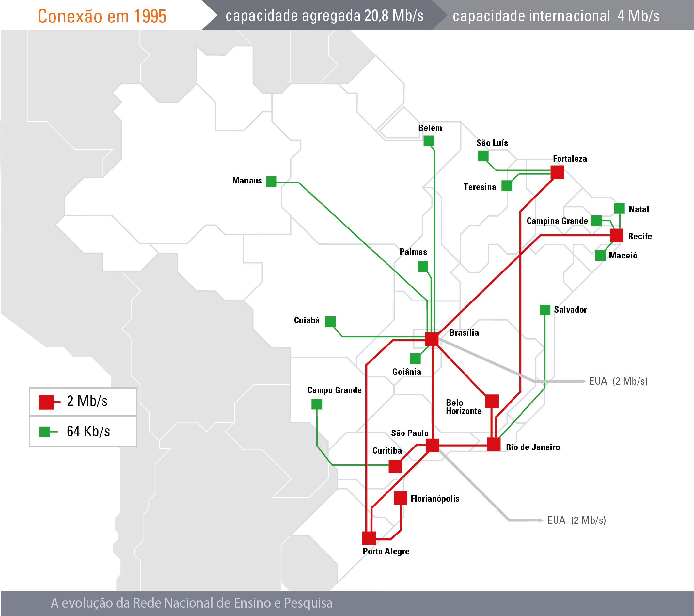
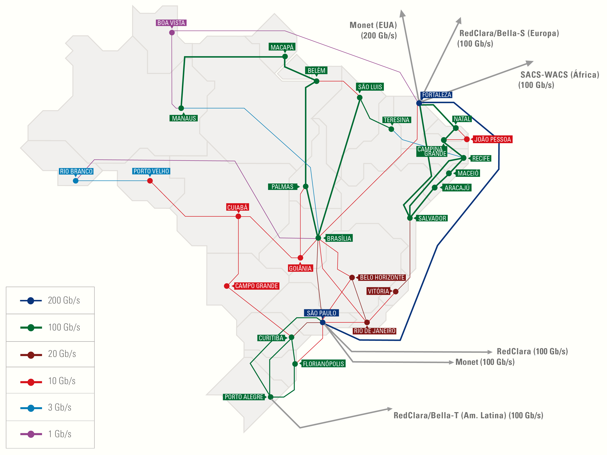

# <!-- fit --> Programação de Sistemas para Internet

### Prof. Diego Cirilo

**Aula 02**: Conceitos Básicos

---
# Internet
- Programação de Sistemas para **INTERNET**
- *Rede mundial de computadores*

---
# Histórico
- A internet começou a ser criada com o projeto do governo americano chamado **ARPANET**
- Tinha o objetivo de interligar Universidades e Instituições de pesquisa e militares

---
# Histórico
- Em 1980 várias outras universidades foram incorporadas
- Em 1985 a NSF (*National Science Foundation*) interligou seus computadores em rede;
- Em 1986 a NSF se junta à ARPANET e essa rede passa a ser chamada de *Internet*;
- Em 1989 a FAPESP (Fundação de Amparo à Pesquisa do Estado de São Paulo) e a LNCC (Laboratório Nacional de Computação Científica) se ligam a Internet
- No mesmo ano foi criada a RNP (Rede Nacional de Pesquisa)

---
# Histórico
- Em 1991 o cientista Tim Berners-Lee do CERN cria o WWW (*World Wide Web*)
    - Antes só existia email, FTP e Telnet
    - Serviços.
- Depois do WWW foi criado o Mosaic, o primeiro navegador para *web*.
- Em 1993 a internet é aberta para exploração comercial nos EUA, e o mesmo ocorre um ano depois no Brasil;

---
# RNP em 1992

---
# RNP em 1995

---
# RNP em 2011

---
# RNP em 2021

---
# WWW
- Sistema de informação que utiliza a internet como meio de transmissão
- Páginas de multimídia interligadas através de *hyperlinks*
- Conceitos:
    - HTTP - Protocolo de transmissão de hypertexto
        - Realiza a comunicação com um servidor Web através de requisições e respostas bem definidas.
    - URL - Sistema de endereços
        - `http://www.ifrn.edu.br/`
    - HTML - Linguagem de marcação de texto
        - Formatação para texto, inserção de imagens e *links*

---
# URL
- *Uniform Resource Locator*
- Protocolo/Domínio/Recurso
    - Ex. *www.ifrn.edu.br*
    - Primeiro nível:
        - .br indica o país. Ex. *.it*, *.pt*, *.mx*
        - Quando não possui o endereço é americano ou internacional.
    - Segundo nível:
        - Tipo de instiuição. Ex. *.edu*, *.com*, *.gov*
    - Terceiro:
        - Nome do site
    - Quarto:
        - Tipo de serviço. Ex. *www*, *mail*, *suap*, etc.
---
# URL

- https://github.com/dvcirilo/psi-ifrn
- https://www.youtube.com/watch?v=GggUi3KQpLc
- https://suap.ifrn.edu.br
- https://g1.globo.com/rn

---
# Protocolo TCP/IP
- Conjunto de regras e padrões que permitem a comunicação entre computadores;
- Também chamado de pilha;
- Organizado em 4 camadas: enlace, internet, transporte e aplicação. 

---
# IP e DNS
- O IP (*Internet Protocol*) é responsável pelo encaminhamento de dados entre as máquinas na rede;
- As máquinas são identificadas por um endereço IP, ex: 122.220.98.4.
- DNS (*Domain Name Server*) é responsável por traduzir as URLs para os IPs dos servidores associados.
- Conveniência.
- Para obter uma URL é necessário pagar para um *registrar*. Ex. GoDaddy, Registro.br

---
# Navegador
- Também chamado de *browser*
    - Aplicativo responsável pelo acesso às páginas web.
    - Transforma/*Renderiza* códigos HTML/JS/CSS em páginas interativas.
    - Ex. Google Chrome, Internet Explorer, Microsoft Edge, Mozilla Firefox, Opera, Brave, Chromium...
- Faz requisições HTTP/HTTPS e renderiza os dados recebidos.
- É o cliente.

---
# <!--fit--> Dúvidas? 🤔
